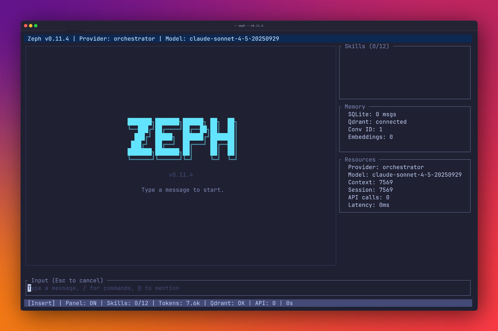

<div align="center">
  

  **The AI agent that respects your resources.**

  Single binary. Minimal hardware. Maximum context efficiency.<br>
  Every token counts — Zeph makes sure none are wasted.

  [](https://crates.io/crates/zeph)
  [](https://bug-ops.github.io/zeph/)
  [](https://github.com/bug-ops/zeph/actions)
  [](https://codecov.io/gh/bug-ops/zeph)
  [](https://github.com/bug-ops/zeph/security)
  [](https://www.rust-lang.org)
  [](LICENSE)
</div>

---

## Why Zeph

Most AI agent frameworks dump every tool description, skill, and raw output into the context window — and bill you for it. Zeph takes the opposite approach: **automated context engineering**. Only relevant data enters the context. The result — lower costs, faster responses, and an agent that runs on hardware you already have.

- **Semantic skill selection** — embeds skills as vectors, retrieves only top-K relevant per query instead of injecting all
- **Smart output filtering** — command-aware filters strip 70-99% of noise before context injection; oversized responses offloaded to filesystem
- **Resilient context compaction** — reactive retry on context overflow, middle-out progressive tool response removal, 9-section structured compaction prompt, LLM-free metadata fallback
- **Tool-pair summarization** — when visible tool call/response pairs exceed a configurable cutoff, the oldest pair is summarized via LLM and originals hidden from context
- **Accurate token counting** — tiktoken-based cl100k_base tokenizer with DashMap cache replaces chars/4 heuristic
- **Proportional budget allocation** — context space distributed by purpose, not arrival order
- **Optimized agent loop hot-path** — compaction check is O(1) via cached token count; `EnvironmentContext` built once at bootstrap and partially refreshed on skill reload; doom-loop hashing done in-place with no intermediate allocations; token counting for tool output pruning reduced to a single call per part

## Installation

> [!TIP]
> ```bash
> curl -fsSL https://github.com/bug-ops/zeph/releases/latest/download/install.sh | sh
> ```

<details>
<summary>Other methods</summary>

```bash
cargo install zeph                                        # crates.io
cargo install --git https://github.com/bug-ops/zeph      # from source
docker pull ghcr.io/bug-ops/zeph:latest                  # Docker
```

Pre-built binaries: [GitHub Releases](https://github.com/bug-ops/zeph/releases/latest) · [Docker guide](https://bug-ops.github.io/zeph/guides/docker.html)

</details>

## Quick Start

```bash
zeph init          # interactive setup wizard
zeph               # run the agent
zeph --tui         # run with TUI dashboard
```

[Full setup guide →](https://bug-ops.github.io/zeph/getting-started/installation.html) · [Configuration reference →](https://bug-ops.github.io/zeph/reference/configuration.html)

## Key Features

| | |
|---|---|
| **Hybrid inference** | Ollama, Claude, OpenAI, Candle (GGUF), any OpenAI-compatible API. Multi-model orchestrator with fallback chains. Response cache with blake3 hashing and TTL. Ollama native tool calling via `llm.ollama.tool_use = true` |
| **Skills-first architecture** | YAML+Markdown skill files with semantic matching, self-learning evolution, 4-tier trust model, and compact prompt mode for small-context models |
| **Semantic memory** | SQLite + Qdrant (or embedded SQLite vector search) with MMR re-ranking, temporal decay scoring, resilient compaction (reactive retry, middle-out tool response removal, 9-section structured prompt, LLM-free fallback), durable compaction with message visibility control, tool-pair summarization (LLM-based, configurable cutoff), credential scrubbing, cross-session recall, vector retrieval, autosave assistant responses, snapshot export/import, configurable SQLite pool, background response-cache cleanup, and native `memory_search`/`memory_save` tools the model can invoke explicitly |
| **Multi-channel I/O** | CLI, Telegram, Discord, Slack, TUI — all with streaming. Vision and speech-to-text input |
| **Protocols** | MCP client (stdio + HTTP), A2A agent-to-agent communication, ACP server for IDE integration (stdio + HTTP+SSE + WebSocket, multi-session with LRU eviction, persistence, idle reaper, permission persistence, multi-modal prompts, runtime model switching, session modes (ask/architect/code), MCP server management via `ext_method`, session export/import), sub-agent orchestration. MCP tools exposed as native `ToolDefinition`s — used via structured tool_use with Claude and OpenAI |
| **Defense-in-depth** | Shell sandbox (blocklist + confirmation patterns for process substitution, here-strings, eval), tool permissions, secret redaction, SSRF protection (HTTPS-only, DNS validation, address pinning, redirect chain re-validation), skill trust quarantine, audit logging. Secrets held in memory as `Zeroizing<String>` — wiped on drop |
| **TUI dashboard** | ratatui-based with syntax highlighting, live metrics, file picker, command palette, daemon mode |
| **Single binary** | ~15 MB, no runtime dependencies, ~50ms startup, ~20 MB idle memory |

[Architecture →](https://bug-ops.github.io/zeph/architecture/overview.html) · [Feature flags →](https://bug-ops.github.io/zeph/reference/feature-flags.html) · [Security model →](https://bug-ops.github.io/zeph/reference/security.html)

## IDE Integration (ACP)

Zeph implements the [Agent Client Protocol](https://agentclientprotocol.com/) — use it as an AI backend in Zed, Helix, VS Code, or any ACP-compatible editor via stdio, HTTP+SSE, or WebSocket transport.

```bash
zeph acp                    # stdio (editor spawns as subprocess)
zeph acp --http :8080       # HTTP+SSE (shared/remote)
zeph acp --ws :8080         # WebSocket
```

### WebSocket transport hardening

The WebSocket transport is hardened against a range of protocol and concurrency issues:

| Property | Value |
|---|---|
| Max concurrent sessions | Configurable; enforced with atomic slot reservation (eliminates TOCTOU race) |
| Keepalive | 30 s ping interval / 90 s pong timeout — idle connections are closed |
| Max message size | 1 MiB |
| Binary frames | Rejected with close code `1003 Unsupported Data` (text-only protocol) |
| Disconnect drain | Write task given 1 s to deliver the RFC 6455 close frame before the socket is dropped |

### Bearer token authentication

Protect the `/acp` (HTTP+SSE) and `/acp/ws` (WebSocket) endpoints with a static bearer token. The discovery endpoint is always exempt.

```toml
# config.toml
[acp]
auth_bearer_token = "your-secret-token"
```

| Method | Value |
|---|---|
| Config key | `acp.auth_bearer_token` |
| Environment variable | `ZEPH_ACP_AUTH_TOKEN` |
| CLI flag | `--acp-auth-token <token>` |

Requests to guarded routes without a valid `Authorization: Bearer <token>` header receive `401 Unauthorized`. When no token is configured, the server runs in open mode — no authentication is enforced. stdio transport is always unaffected.

> [!TIP]
> Always set `auth_bearer_token` when exposing the ACP server on a network interface. For local-only stdio or single-user setups no token is required.

> [!CAUTION]
> Open mode (no token configured) is suitable only for trusted local use. Any process on the same host can issue agent commands without authentication.

### Agent discovery

Zeph publishes a machine-readable agent manifest at `GET /.well-known/acp.json` that ACP-compatible clients use for capability discovery. The manifest includes the agent name, version, supported transports, and authentication type.

```toml
# config.toml
[acp]
discovery_enabled = true   # default: true
```

| Method | Value |
|---|---|
| Config key | `acp.discovery_enabled` |
| Environment variable | `ZEPH_ACP_DISCOVERY_ENABLED=false` to disable |

> [!NOTE]
> The discovery endpoint is intentionally unauthenticated so clients can discover the agent and its auth requirements before presenting credentials. Do not include sensitive data in the manifest. Set `discovery_enabled = false` if the endpoint must not be publicly reachable.

[ACP setup guide →](https://bug-ops.github.io/zeph/advanced/acp.html)

## TUI Demo

<div align="center">
  
</div>

[TUI guide →](https://bug-ops.github.io/zeph/advanced/tui.html)

## Documentation

**[bug-ops.github.io/zeph](https://bug-ops.github.io/zeph/)** — installation, configuration, guides, architecture, and API reference.

## Contributing

See [CONTRIBUTING.md](CONTRIBUTING.md) for development workflow and guidelines.

## Security

The workspace enforces `unsafe_code = "deny"` at the Cargo workspace lint level — no unsafe Rust is permitted in any crate without an explicit override.

Found a vulnerability? Please use [GitHub Security Advisories](https://github.com/bug-ops/zeph/security/advisories/new) for responsible disclosure.

## License

[MIT](LICENSE)
