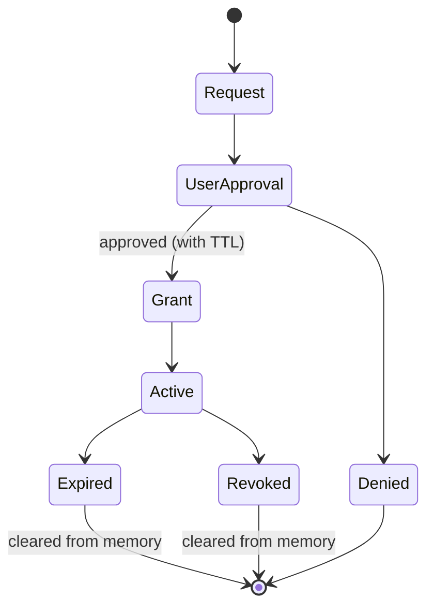
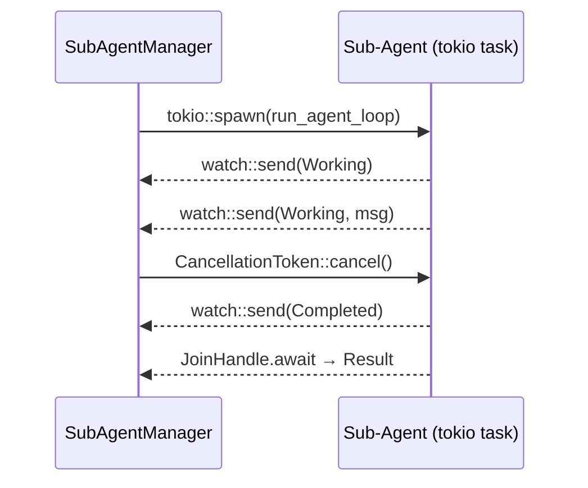

# Sub-Agent Orchestration

Sub-agents let you delegate tasks to specialized helpers that work in the background while you continue chatting with Zeph. Each sub-agent has its own system prompt, tools, and skills — but cannot access anything you haven't explicitly allowed.

## Quick Start

1. Create a definition file:

```markdown
---
name: code-reviewer
description: Reviews code for correctness and style
---

You are a code reviewer. Analyze the provided code for bugs, performance issues, and idiomatic style.
```

2. Save it to `.zeph/agents/code-reviewer.md` in your project (or `~/.config/zeph/agents/` for global use).

3. Spawn the sub-agent:

```
> /agent spawn code-reviewer Review the authentication module
Sub-agent 'code-reviewer' started (id: a1b2c3d4)
```

Or use the shorthand `@mention` syntax:

```
> @code-reviewer Review the authentication module
Sub-agent 'code-reviewer' started (id: a1b2c3d4)
```

That's it. The sub-agent works in the background and reports results when done.

## Managing Sub-Agents

| Command | Description |
|---------|-------------|
| `/agent list` | Show available sub-agent definitions |
| `/agent spawn <name> <prompt>` | Start a sub-agent with a task |
| `/agent bg <name> <prompt>` | Alias for `spawn` |
| `/agent status` | Show active sub-agents with state and progress |
| `/agent cancel <id>` | Cancel a running sub-agent (accepts ID prefix) |
| `/agent resume <id> <prompt>` | Resume a completed sub-agent with its conversation history |
| `/agent approve <id>` | Approve a pending secret request |
| `/agent deny <id>` | Deny a pending secret request |
| `@name <prompt>` | Shorthand for `/agent spawn` |

### Checking Status

```
> /agent status
Active sub-agents:
  [a1b2c3d4] working  turns=3  elapsed=42s  Analyzing auth flow...
```

### Cancelling

The `cancel` command accepts a UUID prefix. If the prefix is ambiguous (matches multiple agents), you'll be asked for a longer prefix:

```
> /agent cancel a1b2
Cancelled sub-agent a1b2c3d4-...
```

### Resuming

Resume a previously completed sub-agent session with `/agent resume`. The agent is re-spawned with its full conversation history loaded from the transcript, so it picks up where it left off:

```
> /agent resume a1b2 Fix the remaining two warnings
Resuming sub-agent a1b2c3d4-... (code-reviewer) with 12 messages
```

The `<id>` argument accepts a UUID prefix, just like `cancel`. The `<prompt>` is appended as a new user message after the restored history.

Resume requires transcript storage to be enabled (it is by default). If the transcript file for the given ID does not exist, the command returns an error.

### Transcript Storage

Every sub-agent session is recorded as a JSONL transcript file in `.zeph/subagents/` (configurable). Each line is a JSON object containing a sequence number, ISO 8601 timestamp, and the full message:

```
.zeph/subagents/
  a1b2c3d4-...-...-....jsonl        # conversation transcript
  a1b2c3d4-...-...-....meta.json    # sidecar metadata
```

The **meta sidecar** (`<agent_id>.meta.json`) stores structured metadata about the session:

```json
{
  "agent_id": "a1b2c3d4-...",
  "agent_name": "code-reviewer",
  "def_name": "code-reviewer",
  "status": "Completed",
  "started_at": "2026-03-05T10:00:00Z",
  "finished_at": "2026-03-05T10:01:38Z",
  "resumed_from": null,
  "turns_used": 5
}
```

When a session is resumed, the new meta sidecar records the original agent ID in `resumed_from`, creating a traceable chain.

Old transcript files are automatically cleaned up. When the file count exceeds `transcript_max_files`, the oldest transcripts (and their sidecars) are deleted on each spawn or resume.

#### Transcript Configuration

Configure transcript behavior in the `[agents]` section of `config.toml`:

```toml
[agents]
# Enable or disable transcript recording (default: true).
# When false, no transcript files are written and /agent resume is unavailable.
transcript_enabled = true

# Directory for transcript files (default: .zeph/subagents).
# transcript_dir = ".zeph/subagents"

# Maximum number of .jsonl files to keep (default: 50).
# Oldest files are deleted when the count exceeds this limit.
# Set to 0 for unlimited (no cleanup).
transcript_max_files = 50
```

## Writing Definitions

A definition is a markdown file with YAML frontmatter between `---` delimiters. The body after the closing `---` becomes the sub-agent's system prompt.

> **Note:** Prior to v0.13, definitions used TOML frontmatter (`+++`). That format is still accepted but deprecated and will be removed in v1.0.0. Migrate by replacing `+++` delimiters with `---` and converting the body to YAML syntax.

### Minimal Definition

Only `name` and `description` are required. Everything else has sensible defaults:

```markdown
---
name: helper
description: General-purpose helper
---

You are a helpful assistant. Complete the given task concisely.
```

### Full Definition

```markdown
---
name: code-reviewer
description: Reviews code changes for correctness and style
model: claude-sonnet-4-20250514
background: false
max_turns: 10
memory: project
tools:
  allow:
    - shell
    - web_scrape
  except:
    - shell_sudo
permissions:
  permission_mode: accept_edits
  secrets:
    - github-token
  timeout_secs: 300
  ttl_secs: 120
skills:
  include:
    - "git-*"
    - "rust-*"
  exclude:
    - "deploy-*"
hooks:
  PreToolUse:
    - matcher: "Bash"
      hooks:
        - type: command
          command: "./scripts/validate.sh"
  PostToolUse:
    - matcher: "Edit|Write"
      hooks:
        - type: command
          command: "./scripts/lint.sh"
---

You are a code reviewer. Analyze the provided code for:
- Correctness bugs
- Performance issues
- Idiomatic Rust style

Report findings as a structured list with severity (critical/warning/info).
```

### Field Reference

| Field | Type | Default | Description |
|-------|------|---------|-------------|
| `name` | string | required | Unique identifier |
| `description` | string | required | Human-readable description |
| `model` | string | inherited | LLM model override |
| `background` | bool | `false` | Run as a background task; secret requests are auto-denied inline |
| `max_turns` | u32 | `20` | Maximum LLM turns before the agent is stopped |
| `memory` | string | — | Persistent memory scope: `user`, `project`, or `local` (see [Persistent Memory](#persistent-memory)) |
| `tools.allow` | string[] | — | Only these tools are available (mutually exclusive with `deny`) |
| `tools.deny` | string[] | — | All tools except these (mutually exclusive with `allow`) |
| `tools.except` | string[] | `[]` | Additional denylist applied on top of `allow`/`deny`; deny always wins over allow; exact match on tool ID |
| `permissions.permission_mode` | enum | `default` | Tool call approval policy (see below) |
| `permissions.secrets` | string[] | `[]` | Vault keys the agent MAY request |
| `permissions.timeout_secs` | u64 | `600` | Hard kill deadline |
| `permissions.ttl_secs` | u64 | `300` | TTL for granted permissions |
| `skills.include` | string[] | all | Glob patterns to include (`*` wildcard) |
| `skills.exclude` | string[] | `[]` | Glob patterns to exclude (takes precedence) |
| `hooks.PreToolUse` | HookMatcher[] | `[]` | Hooks fired before tool execution (see [Hooks](#hooks)) |
| `hooks.PostToolUse` | HookMatcher[] | `[]` | Hooks fired after tool execution (see [Hooks](#hooks)) |

If neither `tools.allow` nor `tools.deny` is specified, the sub-agent inherits all tools from the main agent.

### `permission_mode` Values

| Value | Description |
|-------|-------------|
| `default` | Standard interactive prompts — the user is asked before each sensitive tool call |
| `accept_edits` | File edit and write operations are auto-accepted without prompting |
| `dont_ask` | All tool calls are auto-approved without any prompt |
| `bypass_permissions` | Same as `dont_ask` but emits a warning at definition load time |
| `plan` | The agent can see the tool catalog but cannot execute any tools; produces text-only output |

> [!CAUTION]
> `bypass_permissions` skips all tool-call approval prompts. Only use it in fully trusted, sandboxed environments.

> [!TIP]
> Use `plan` mode when you only need a structured action plan from the agent and want to review it before any tools are executed.

### `tools.except` — Additional Denylist

`tools.except` lets you block specific tool IDs regardless of what `allow` or `deny` says. Deny always wins over allow, so a tool listed in both `allow` and `except` is blocked.

```yaml
tools:
  allow:
    - shell
    - web_scrape
  except:
    - shell_sudo    # blocked even though shell is in allow
```

Use `except` to tighten an existing allow list without rewriting it.

### `background` — Fire-and-Forget Execution

When `background: true`, the agent runs without blocking the conversation. Secret requests that would normally open an interactive prompt are auto-denied inline instead, so the main session is never paused waiting for user input.

```yaml
---
name: nightly-linter
description: Runs cargo clippy on the workspace nightly
background: true
max_turns: 5
tools:
  allow:
    - shell
---

Run `cargo clippy --workspace -- -D warnings` and report any new warnings introduced since the last run.
```

Results appear in `/agent status` and the TUI panel when the task completes.

### `max_turns` — Turn Limit

`max_turns` caps the number of LLM turns the agent may take. The agent is stopped automatically when the limit is reached, preventing runaway inference loops.

```yaml
---
name: summarizer
description: Summarizes long documents
max_turns: 3
---

Summarize the provided content in three bullet points.
```

The default is `20`. Set a lower value for narrow, well-defined tasks.

### Definition Locations

| Path | Scope | Priority |
|------|-------|----------|
| `.zeph/agents/` | Project | Higher (wins on name conflict) |
| `~/.config/zeph/agents/` | User (global) | Lower |

## Managing Definitions

Use the `zeph agents` subcommand to list, inspect, create, edit, and delete sub-agent definitions from the command line.

### List

```
$ zeph agents list
NAME             SCOPE                    DESCRIPTION                       MODEL
code-reviewer    project/code-reviewer…   Reviews code for correctness      claude-sonnet-4-20250514
test-writer      user/test-writer.md      Generates unit tests              -
```

### Show

```
$ zeph agents show code-reviewer
Name:        code-reviewer
Description: Reviews code for correctness
Source:      project/code-reviewer.md
Model:       claude-sonnet-4-20250514
Mode:        Default
Max turns:   10
Background:  false
Tools:       allow ["shell", "web_scrape"]

System prompt:
You are a code reviewer...
```

### Create

```
$ zeph agents create reviewer --description "Code review helper"
Created .zeph/agents/reviewer.md

$ zeph agents create reviewer --description "Code review helper" --model claude-sonnet-4-20250514
Created .zeph/agents/reviewer.md

$ zeph agents create reviewer --description "Global helper" --dir ~/.config/zeph/agents/
Created /Users/you/.config/zeph/agents/reviewer.md
```

Options:
- `--description` / `-d` — short description (required)
- `--model` — model override (optional)
- `--dir` — target directory (default: `.zeph/agents/`)

### Edit

Opens the definition file in `$VISUAL` or `$EDITOR` (falls back to `vi`). After the editor closes, Zeph re-parses the file to validate it:

```
$ zeph agents edit reviewer
# $EDITOR opens .zeph/agents/reviewer.md
Updated /path/to/.zeph/agents/reviewer.md
```

### Delete

```
$ zeph agents delete reviewer
Delete /path/to/.zeph/agents/reviewer.md? [y/N] y
Deleted reviewer
```

Use `--yes` / `-y` to skip the confirmation prompt.

### TUI Panel

The TUI command palette (`/`) includes `agents:*` entries. Select one to open the agent manager overlay or populate the input bar with the corresponding `/agent` command. Open the overlay directly by typing `/agents` in the command palette and selecting `agents:list`.

The agent manager overlay provides keyboard navigation over all loaded definitions:

| Key | Action |
|-----|--------|
| `j` / `k` or arrows | Navigate list |
| `Enter` | Open detail view |
| `c` | Create new definition (wizard form) |
| `e` (in detail view) | Edit via form |
| `d` (in detail view) | Delete with confirmation |
| `Esc` | Go back / close panel |

> **Note:** The TUI wizard edits `name`, `description`, `model`, and `max_turns` fields only. To edit `hooks`, `memory`, `skills`, or the system prompt, use `zeph agents edit` with `$EDITOR`.
>
> Saving via the TUI form rewrites the file and removes YAML comments. Use the CLI `edit` command to preserve hand-written formatting.

## Persistent Memory

Sub-agents can maintain persistent state across sessions via a `MEMORY.md` file and topic-specific files in a dedicated memory directory. This lets agents build knowledge over time without starting from scratch on every spawn.

### Enabling Memory

Add the `memory` field to a definition's YAML frontmatter:

```yaml
---
name: code-reviewer
description: Reviews code for correctness and style
memory: project
---
```

Or set a global default in `config.toml` (applies to all agents without an explicit `memory` field):

```toml
[agents]
default_memory_scope = "project"
```

### Memory Scopes

| Scope | Directory | Use Case |
|-------|-----------|----------|
| `user` | `~/.zeph/agent-memory/<name>/` | Cross-project memory shared between same-named agents. Do not store project-specific secrets here. |
| `project` | `.zeph/agent-memory/<name>/` | Project-scoped memory, suitable for version control. |
| `local` | `.zeph/agent-memory-local/<name>/` | Project-scoped but not committed. Add `.zeph/agent-memory-local/` to `.gitignore`. |

The memory directory is created automatically on first spawn. If the directory already exists, its contents are preserved.

### How It Works

1. **Directory creation** — At spawn time, Zeph creates the memory directory if it does not exist.
2. **MEMORY.md injection** — The first 200 lines of `MEMORY.md` are loaded and injected into the system prompt after the behavioral prompt, wrapped in `<agent-memory>` tags. Lines beyond 200 are truncated with a pointer to the full file.
3. **File tool access** — The agent uses Read, Write, and Edit tools to maintain `MEMORY.md` and create topic-specific files (e.g., `patterns.md`, `debugging.md`).
4. **Prompt ordering** — The behavioral system prompt (from the definition body) always takes precedence over memory content.

### Auto-Enabled File Tools

When an agent uses `tools.allow` (allowlist mode) and has memory enabled, Zeph automatically adds `Read`, `Write`, and `Edit` to the allowed tool list. A warning is logged so you know the tools were implicitly added:

```
WARN auto-enabled file tools for memory access — add ["Read", "Write", "Edit"]
     to tools.allow to suppress this warning
```

To silence the warning, explicitly include the file tools in your allowlist:

```yaml
tools:
  allow:
    - shell
    - Read
    - Write
    - Edit
```

If all three file tools are blocked (via `tools.except` or `tools.deny`), memory is silently disabled — the directory is not created and no content is injected.

### Security

- **Agent name validation** — Names must match `^[a-zA-Z0-9][a-zA-Z0-9_-]{0,63}$`. Path traversal attempts (e.g., `../etc/passwd`) are rejected.
- **Symlink boundary check** — `MEMORY.md` is canonicalized before reading. If the resolved path escapes the memory directory (e.g., via a symlink), the file is silently skipped.
- **Size cap** — Files larger than 256 KiB are rejected.
- **Null byte guard** — Files containing null bytes are rejected.
- **Tag escaping** — `<agent-memory>` tags in memory content are escaped to prevent prompt injection. Since `MEMORY.md` is agent-written (not user-written), this stricter escaping is applied by default.
- **Local scope .gitignore check** — When using `local` scope, Zeph warns if `.zeph/agent-memory-local/` is not in `.gitignore`.

## Tool and Skill Access

### Tool Filtering

Control which tools a sub-agent can use:

- **Allow list** — only listed tools are available:
  ```yaml
  tools:
    allow:
      - shell
      - web_scrape
  ```
- **Deny list** — all tools except listed:
  ```yaml
  tools:
    deny:
      - shell
  ```
- **Except list** — additional block on top of allow or deny (deny always wins):
  ```yaml
  tools:
    allow:
      - shell
      - web_scrape
    except:
      - shell_sudo
  ```
- **Inherit all** — omit both `allow` and `deny`

Filtering is enforced at the executor level. The sub-agent's LLM only sees tool definitions it can actually call. Blocked tool calls return an error.

### Skill Filtering

Skills are filtered by glob patterns with `*` wildcard:

```yaml
skills:
  include:
    - "git-*"
    - "rust-*"
  exclude:
    - "deploy-*"
```

- Empty `include` = all skills pass (unless excluded)
- `exclude` always takes precedence over `include`

## Security Model

Sub-agents follow a zero-trust principle: they start with **zero permissions** and can only access what you explicitly grant.

### How It Works

1. **Definitions declare capabilities, not permissions.** Writing `secrets: [github-token]` means the agent _may request_ that secret — it doesn't get it automatically.

2. **Secrets require your approval.** When a sub-agent needs a secret, Zeph prompts you:

   > Sub-agent 'code-reviewer' requests 'github-token' (TTL: 120s). Allow? [y/n]

3. **Everything expires.** Granted permissions and secrets are automatically revoked after `ttl_secs` or when the sub-agent finishes — whichever comes first.

4. **Secrets stay in memory only.** They are never written to disk, message history, or logs.

### Permission Lifecycle



### Safety Guarantees

- Concurrency limit prevents resource exhaustion
- `permissions.timeout_secs` provides a hard kill deadline
- `max_turns` prevents runaway LLM loops
- Background agents auto-deny secret requests so the main session is never blocked
- All grants are revoked on completion, cancellation, or crash
- Secret key names are redacted in logs

## Hooks

Hooks let you run shell commands at specific points in a sub-agent's lifecycle. Use them to validate tool inputs, run linters after file edits, set up resources on agent start, or clean up on agent stop.

There are two hook scopes:

- **Per-agent hooks** — defined in the agent's YAML frontmatter, scoped to tool use events (`PreToolUse`, `PostToolUse`)
- **Config-level hooks** — defined in `config.toml`, scoped to agent lifecycle events (`SubagentStart`, `SubagentStop`)

### Per-Agent Hooks (PreToolUse / PostToolUse)

Add a `hooks` section to the agent's YAML frontmatter. Each event contains a list of matchers, and each matcher specifies which tools it applies to and what commands to run:

```yaml
---
name: code-reviewer
description: Reviews code for correctness and style
hooks:
  PreToolUse:
    - matcher: "Bash"
      hooks:
        - type: command
          command: "./scripts/validate.sh"
          timeout_secs: 10
          fail_closed: true
  PostToolUse:
    - matcher: "Edit|Write"
      hooks:
        - type: command
          command: "./scripts/lint.sh"
---
```

**`PreToolUse`** fires before a tool is executed. Set `fail_closed: true` to block execution if the hook exits non-zero.

**`PostToolUse`** fires after a tool finishes. Useful for linting, formatting, or auditing changes.

### Matcher Syntax

The `matcher` field is a pipe-separated list of tokens. A tool matches when its name contains any of the listed tokens (case-sensitive substring match):

| Matcher | Matches | Does not match |
|---------|---------|----------------|
| `"Bash"` | `Bash` | `Edit`, `Write` |
| `"Edit\|Write"` | `Edit`, `WriteFile` | `Bash`, `Read` |
| `"Shell"` | `Shell`, `ShellExec` | `Bash` |

### Hook Definition Fields

| Field | Type | Default | Description |
|-------|------|---------|-------------|
| `type` | string | required | Hook type — currently only `"command"` is supported |
| `command` | string | required | Shell command to execute (passed to `sh -c`) |
| `timeout_secs` | u64 | `30` | Maximum execution time before the hook is killed |
| `fail_closed` | bool | `false` | When `true`, a non-zero exit or timeout causes the calling operation to fail; when `false`, errors are logged and execution continues |

### Config-Level Hooks (SubagentStart / SubagentStop)

Define lifecycle hooks in `config.toml` under `[agents.hooks]`. These run for every sub-agent:

```toml
[agents.hooks]

[[agents.hooks.start]]
type = "command"
command = "echo agent started"
timeout_secs = 10

[[agents.hooks.stop]]
type = "command"
command = "./scripts/cleanup.sh"
```

**`start`** hooks fire after a sub-agent is spawned. **`stop`** hooks fire after a sub-agent finishes or is cancelled. Both are fire-and-forget — errors are logged but do not affect the agent's operation.

### Environment Variables

Hook processes receive a clean environment with only the `PATH` variable preserved from the parent process. The following Zeph-specific variables are set:

| Variable | Description |
|----------|-------------|
| `ZEPH_AGENT_ID` | UUID of the sub-agent instance |
| `ZEPH_AGENT_NAME` | Name from the agent definition |
| `ZEPH_TOOL_NAME` | Tool name (only for `PreToolUse` / `PostToolUse`) |

### Security

Hooks follow a trust-boundary model:

- **Project-level definitions** (`.zeph/agents/`) may contain hooks — they are trusted because they live in the project repository.
- **User-level definitions** (`~/.config/zeph/agents/`) have all hooks stripped on load. This prevents untrusted global definitions from running arbitrary commands in any project.
- Hook processes run with a **cleared environment** (`env_clear()`). Only `PATH` is preserved from the parent to prevent accidental secret leakage.
- Child processes are **explicitly killed on timeout** to prevent orphan processes.

> **Note:** If you need hooks on a globally shared agent, move the definition into the project's `.zeph/agents/` directory instead.

## Global Agent Defaults

The `[agents]` section in `config.toml` sets defaults that apply to all sub-agents unless overridden by the individual definition:

```toml
[agents]
# Default permission mode for sub-agents that do not set one explicitly.
# "default" and omitting this field are equivalent — both result in standard
# interactive prompts.
# Valid values: "default", "accept_edits", "dont_ask"
# (bypass_permissions and plan are not useful as global defaults)
default_permission_mode = "default"

# Tool IDs blocked for all sub-agents, regardless of what their definition allows.
# Appended on top of any per-definition tool filtering.
default_disallowed_tools = []

# Must be true to allow any sub-agent definition to use bypass_permissions mode.
# When false (the default), spawning a definition with permission_mode: bypass_permissions
# is rejected at load time with an error.
allow_bypass_permissions = false

# Enable JSONL transcript recording for sub-agent sessions (default: true).
# When false, /agent resume is unavailable.
transcript_enabled = true

# Directory for transcript files (default: .zeph/subagents).
# transcript_dir = ".zeph/subagents"

# Maximum number of transcript files to keep (default: 50).
# Set to 0 for unlimited.
transcript_max_files = 50

# Default memory scope for agents that do not set `memory` in their frontmatter.
# Valid values: "user", "project", "local"
# Omit or set to null to disable memory by default.
# default_memory_scope = "project"

# Lifecycle hooks — run for every sub-agent start/stop.
# See the Hooks section above for the full schema.
# [agents.hooks]
# [[agents.hooks.start]]
# type = "command"
# command = "echo started"
# [[agents.hooks.stop]]
# type = "command"
# command = "./scripts/cleanup.sh"
```

> **Note:** `default_permission_mode = "default"` and omitting the field are equivalent — both leave per-agent prompting behavior unchanged.

> **Caution:** Set `allow_bypass_permissions = true` only in fully trusted, sandboxed environments. Without this flag, any definition requesting `bypass_permissions` mode is rejected at load time.

## Context Propagation

Sub-agents inherit context from the parent agent to reduce cold-start overhead:

- **Conversation history**: the parent's recent conversation history is forwarded to the sub-agent's initial context, giving it awareness of what has been discussed
- **Cancellation**: the parent's cancellation token is propagated so that cancelling the parent also cancels active sub-agents
- **Model inheritance**: sub-agents inherit the parent's active model unless overridden in the definition's `model` field

Sub-agents no longer exit after a single text-only LLM response — they continue the conversation loop until the task is complete or `max_turns` is reached.

### MCP Tool Awareness

Sub-agent system prompts are automatically annotated with the names of available MCP tools from connected servers. This helps the sub-agent's LLM understand what external capabilities are available without injecting full tool schemas.

## Interactive TUI Sidebar

When the `tui` feature is enabled, pressing `Tab` in Normal mode cycles to the sub-agent sidebar. The sidebar provides:

- Live status for all active sub-agents with color-coded indicators
- A transcript viewer that shows the full conversation history of a selected sub-agent
- Keyboard navigation: `j`/`k` to select agents, `Enter` to open the transcript, `Esc` to close

## TUI Dashboard Panel

When the `tui` feature is enabled, a Sub-Agents panel appears in the sidebar showing active agents with color-coded status:

```
┌ Sub-Agents (2) ─────────────────────────┐
│  code-reviewer [plan]  WORKING  3/20  42s │
│  test-writer [bg] [bypass!]  COMPLETED 10/20  100s │
└─────────────────────────────────────────┘
```

Colors: yellow = working, green = completed, red = failed, cyan = input required.

Permission mode badges: `[plan]`, `[accept_edits]`, `[dont_ask]`, `[bypass!]`. The `default` mode shows no badge.

## Architecture

Sub-agents run as in-process tokio tasks — not separate processes. The main agent communicates with them via lightweight primitives:



| Primitive | Direction | Purpose |
|-----------|-----------|---------|
| `watch::channel` | Agent → Manager | Real-time status updates |
| `JoinHandle` | Agent → Manager | Final result collection |
| `CancellationToken` | Manager → Agent | Graceful cancellation |

### `@mention` vs File References

The TUI uses `@` for both sub-agent mentions and file references. Zeph resolves ambiguity by checking the token after `@` against known agent names:

```
@code-reviewer review src/main.rs   → sub-agent mention
@src/main.rs                        → file reference
```

## API Reference

For programmatic use, `SubAgentManager` provides the full lifecycle API:

```rust
let mut manager = SubAgentManager::new(/* max_concurrent */ 4);

manager.load_definitions(&[
    project_dir.join(".zeph/agents"),
    dirs::config_dir().unwrap().join("zeph/agents"),
])?;

let task_id = manager.spawn("code-reviewer", "Review src/main.rs", provider, executor, None)?;
let statuses = manager.statuses();
manager.cancel(&task_id)?;
let result = manager.collect(&task_id).await?;
```

| Method | Description |
|--------|-------------|
| `load_definitions(&[PathBuf])` | Load `.md` definitions (first-wins deduplication) |
| `spawn(name, prompt, provider, executor, skills)` | Spawn a sub-agent, returns task ID |
| `cancel(task_id)` | Cancel and revoke all grants |
| `collect(task_id)` | Await result and remove from active set |
| `statuses()` | Snapshot of all active sub-agent states |
| `approve_secret(task_id, key, ttl)` | Grant a vault secret after user approval |
| `shutdown_all()` | Cancel all active sub-agents (used on exit) |

### Error Types

| Variant | When |
|---------|------|
| `Parse` | Invalid frontmatter or YAML/TOML |
| `Invalid` | Validation failure (empty name, mutual exclusion) |
| `NotFound` | Unknown definition name or task ID |
| `Spawn` | Concurrency limit reached or task panic |
| `Cancelled` | Sub-agent was cancelled |

## Background Lifecycle (Phase 5 — Planned)

> **Planned** — The features in this section are part of Phase 5 (#1145) and not yet available.

Phase 5 closes the gap between fire-and-forget background agents and a full lifecycle model with timeout enforcement, result persistence, completion notifications, and new CLI commands for inspecting agent output.

### Timeout Enforcement

> **Planned** — This feature is part of Phase 5 (#1145) and not yet available.

The `permissions.timeout_secs` field is currently parsed from agent definitions but **not enforced at runtime**. A runaway background agent can consume resources indefinitely.

Phase 5 wraps the agent loop in `tokio::time::timeout` so agents are killed when the deadline expires:

```rust
let timeout_dur = Duration::from_secs(def.permissions.timeout_secs);
let join_handle = tokio::spawn(async move {
    match tokio::time::timeout(timeout_dur, run_agent_loop(args)).await {
        Ok(result) => result,
        Err(_elapsed) => {
            tracing::warn!("sub-agent timed out after {timeout_dur:?}");
            Err(anyhow::anyhow!("sub-agent timed out after {}s", timeout_dur.as_secs()))
        }
    }
});
```

The default timeout is **600 seconds** (10 minutes). Override it per agent:

```yaml
---
name: long-running-task
description: Agent with a custom timeout
permissions:
  timeout_secs: 1800  # 30 minutes
---
```

Timeout is wall-clock time, independent of `max_turns`. Both limits are enforced simultaneously — whichever fires first stops the agent.

### Completion Notifications

> **Planned** — This feature is part of Phase 5 (#1145) and not yet available.

Currently the parent agent must poll `/agent status` to discover when a background agent finishes. Phase 5 introduces a `CompletionEvent` that fires when any agent reaches a terminal state (completed, failed, cancelled, or timed out):

```rust
pub struct CompletionEvent {
    pub task_id: String,
    pub agent_name: String,
    pub state: SubAgentState,
    pub elapsed: Duration,
}
```

The event carries only metadata — no result summary. Consumers read the full output from the persisted output file or SQLite table.

Delivery uses a **cooperative sweep-on-access** model rather than a background task. The manager's `reap_completed()` method is called from the agent loop, collects all finished handles, persists results, and returns completion events. This avoids shared-ownership complexity since `SubAgentManager` is not behind `Arc<Mutex>`.

### Result Persistence

> **Planned** — This feature is part of Phase 5 (#1145) and not yet available.

Background agent results are currently ephemeral — stored as in-memory strings, lost if not explicitly collected or on process exit. Phase 5 adds dual persistence:

**Output files** — The final result is written to `.zeph/agent-output/<task_id>.txt` with a 1 MiB cap and 24-hour retention. Files are cleaned up by the reaper on the next sweep.

**SQLite table** — A `background_results` table stores structured metadata:

```sql
CREATE TABLE IF NOT EXISTS background_results (
    task_id     TEXT PRIMARY KEY,
    agent_name  TEXT NOT NULL,
    success     INTEGER NOT NULL,
    result_text TEXT NOT NULL,
    turns_used  INTEGER NOT NULL,
    elapsed_ms  INTEGER NOT NULL,
    created_at  TEXT NOT NULL DEFAULT (datetime('now'))
);
```

Configure persistence in `config.toml`:

```toml
[agents]
output_dir = ".zeph/agent-output"       # default
output_retention_secs = 86400           # 24h, default
output_max_bytes = 1048576              # 1 MiB, default
```

### New CLI Commands

> **Planned** — This feature is part of Phase 5 (#1145) and not yet available.

| Command | Description |
|---------|-------------|
| `/agent output <id>` | Print the persisted output file for a completed agent |
| `/agent collect <id>` | Collect a specific agent's result |
| `/agent collect` | Collect all completed agents at once |

`/agent collect` without arguments collects all agents in a terminal state (completed, failed, timed out). Active agents are skipped — the command never blocks waiting for a running agent to finish. `/agent collect <id>` collects a specific agent by ID prefix.

Example workflow:

```
> /agent bg code-reviewer Review the auth module
Sub-agent 'code-reviewer' started (id: a1b2c3d4)

> /agent status
Active sub-agents:
  [a1b2c3d4] completed  turns=5  elapsed=38s

> /agent output a1b2
--- Output for a1b2c3d4 (code-reviewer) ---
Found 2 issues in the auth module:
1. [critical] Token expiry check missing in refresh_token()
2. [warning] Redundant clone on line 42
---

> /agent collect
Collected 1 completed agent(s).
```

### Structured Result Type

> **Planned** — This feature is part of Phase 5 (#1145) and not yet available.

The current `run_agent_loop` returns a raw `String`. Phase 5 replaces it with a structured `AgentResult`:

```rust
pub struct AgentResult {
    pub final_response: String,
    pub conversation: Vec<Message>,  // full message history
    pub turns_used: u32,
    pub elapsed: Duration,
    pub timed_out: bool,
}
```

This enables `/agent output` to show the full result, and `collect()` to return structured data for programmatic use. The `JoinHandle` type changes from `Result<String>` to `Result<AgentResult>`.

### Progress Streaming

> **Planned** — This feature is part of Phase 5 (#1145) and not yet available.

The `last_message` field in `SubAgentStatus` is currently truncated to 120 characters, providing minimal visibility into agent progress. Phase 5 makes two improvements:

1. **Increased truncation limit** — `last_message` truncation increases from 120 to 500 characters for immediate benefit without breaking changes.

2. **Dedicated progress channel** — A separate `mpsc::Sender<ProgressUpdate>` channel carries full per-turn output alongside the existing `watch` channel:

```rust
pub struct ProgressUpdate {
    pub turn: u32,
    pub content: String,            // full LLM response for this turn
    pub tool_output: Option<String>, // tool result if applicable
}
```

The `watch` channel remains for lightweight status polling (no breaking change to `SubAgentStatus`). The progress channel has a capacity of 32 messages — unread messages are dropped when the buffer is full to prevent OOM.

Access progress updates via `SubAgentManager::drain_progress(task_id) -> Vec<ProgressUpdate>`.

### Hook Improvements

> **Planned** — This feature is part of Phase 5 (#1145) and not yet available.

Phase 5 adds a new environment variable to `SubagentStop` hooks:

| Variable | Description |
|----------|-------------|
| `ZEPH_AGENT_EXIT_REASON` | Exit reason: `completed`, `failed`, `canceled`, or `timed_out` |

This allows stop hooks to take different actions based on how the agent ended — for example, sending a notification only on failure or cleaning up resources only on timeout.

Phase 5 also fixes a bug where `SubagentStop` hooks fire twice when a running agent is cancelled and then collected. The fix ensures the hook fires exactly once at the first terminal state transition.
