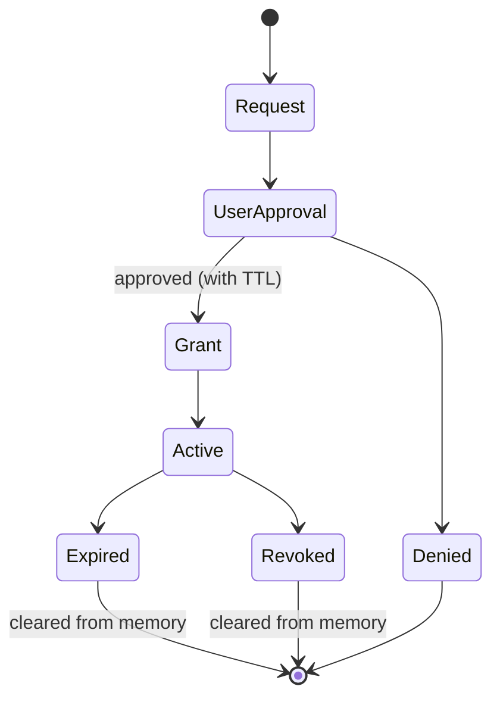
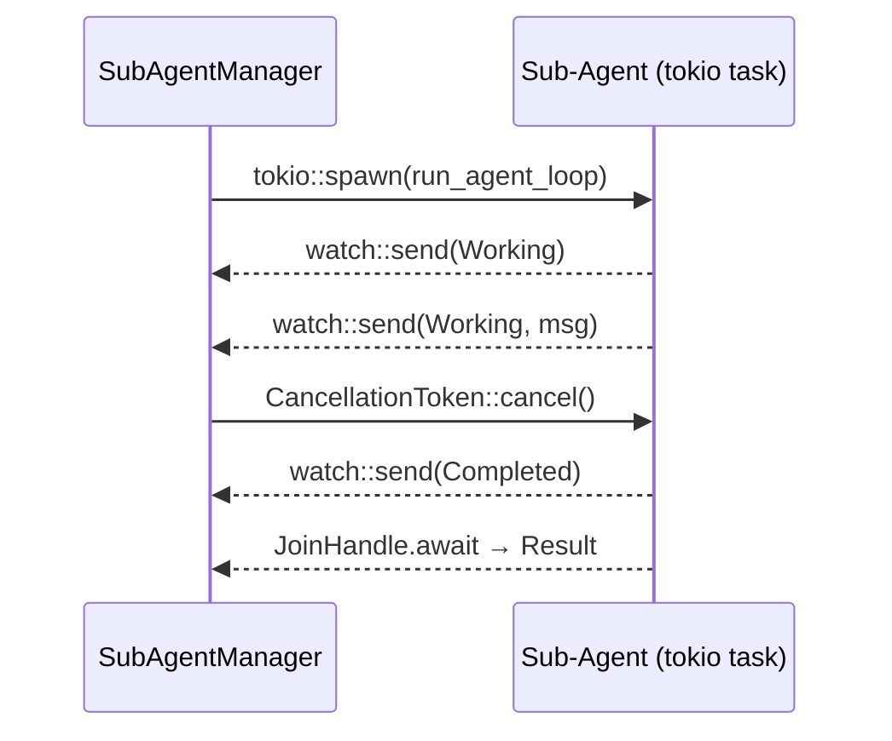

# Sub-Agent Orchestration

Sub-agents let you delegate tasks to specialized helpers that work in the background while you continue chatting with Zeph. Each sub-agent has its own system prompt, tools, and skills — but cannot access anything you haven't explicitly allowed.

## Quick Start

1. Create a definition file:

```markdown
---
name: code-reviewer
description: Reviews code for correctness and style
---

You are a code reviewer. Analyze the provided code for bugs, performance issues, and idiomatic style.
```

2. Save it to `.zeph/agents/code-reviewer.md` in your project (or `~/.config/zeph/agents/` for global use).

3. Spawn the sub-agent:

```
> /agent spawn code-reviewer Review the authentication module
Sub-agent 'code-reviewer' started (id: a1b2c3d4)
```

Or use the shorthand `@mention` syntax:

```
> @code-reviewer Review the authentication module
Sub-agent 'code-reviewer' started (id: a1b2c3d4)
```

That's it. The sub-agent works in the background and reports results when done.

## Managing Sub-Agents

| Command | Description |
|---------|-------------|
| `/agent list` | Show available sub-agent definitions |
| `/agent spawn <name> <prompt>` | Start a sub-agent with a task |
| `/agent bg <name> <prompt>` | Alias for `spawn` |
| `/agent status` | Show active sub-agents with state and progress |
| `/agent cancel <id>` | Cancel a running sub-agent (accepts ID prefix) |
| `/agent approve <id>` | Approve a pending secret request |
| `/agent deny <id>` | Deny a pending secret request |
| `@name <prompt>` | Shorthand for `/agent spawn` |

### Checking Status

```
> /agent status
Active sub-agents:
  [a1b2c3d4] working  turns=3  elapsed=42s  Analyzing auth flow...
```

### Cancelling

The `cancel` command accepts a UUID prefix. If the prefix is ambiguous (matches multiple agents), you'll be asked for a longer prefix:

```
> /agent cancel a1b2
Cancelled sub-agent a1b2c3d4-...
```

## Writing Definitions

A definition is a markdown file with YAML frontmatter between `---` delimiters. The body after the closing `---` becomes the sub-agent's system prompt.

> **Note:** Prior to v0.13, definitions used TOML frontmatter (`+++`). That format is still accepted but deprecated and will be removed in v1.0.0. Migrate by replacing `+++` delimiters with `---` and converting the body to YAML syntax.

### Minimal Definition

Only `name` and `description` are required. Everything else has sensible defaults:

```markdown
---
name: helper
description: General-purpose helper
---

You are a helpful assistant. Complete the given task concisely.
```

### Full Definition

```markdown
---
name: code-reviewer
description: Reviews code changes for correctness and style
model: claude-sonnet-4-20250514
background: false
max_turns: 10
tools:
  allow:
    - shell
    - web_scrape
  except:
    - shell_sudo
permissions:
  permission_mode: accept_edits
  secrets:
    - github-token
  timeout_secs: 300
  ttl_secs: 120
skills:
  include:
    - "git-*"
    - "rust-*"
  exclude:
    - "deploy-*"
hooks:
  PreToolUse:
    - matcher: "Bash"
      hooks:
        - type: command
          command: "./scripts/validate.sh"
  PostToolUse:
    - matcher: "Edit|Write"
      hooks:
        - type: command
          command: "./scripts/lint.sh"
---

You are a code reviewer. Analyze the provided code for:
- Correctness bugs
- Performance issues
- Idiomatic Rust style

Report findings as a structured list with severity (critical/warning/info).
```

### Field Reference

| Field | Type | Default | Description |
|-------|------|---------|-------------|
| `name` | string | required | Unique identifier |
| `description` | string | required | Human-readable description |
| `model` | string | inherited | LLM model override |
| `background` | bool | `false` | Run as a background task; secret requests are auto-denied inline |
| `max_turns` | u32 | `20` | Maximum LLM turns before the agent is stopped |
| `tools.allow` | string[] | — | Only these tools are available (mutually exclusive with `deny`) |
| `tools.deny` | string[] | — | All tools except these (mutually exclusive with `allow`) |
| `tools.except` | string[] | `[]` | Additional denylist applied on top of `allow`/`deny`; deny always wins over allow; exact match on tool ID |
| `permissions.permission_mode` | enum | `default` | Tool call approval policy (see below) |
| `permissions.secrets` | string[] | `[]` | Vault keys the agent MAY request |
| `permissions.timeout_secs` | u64 | `600` | Hard kill deadline |
| `permissions.ttl_secs` | u64 | `300` | TTL for granted permissions |
| `skills.include` | string[] | all | Glob patterns to include (`*` wildcard) |
| `skills.exclude` | string[] | `[]` | Glob patterns to exclude (takes precedence) |
| `hooks.PreToolUse` | HookMatcher[] | `[]` | Hooks fired before tool execution (see [Hooks](#hooks)) |
| `hooks.PostToolUse` | HookMatcher[] | `[]` | Hooks fired after tool execution (see [Hooks](#hooks)) |

If neither `tools.allow` nor `tools.deny` is specified, the sub-agent inherits all tools from the main agent.

### `permission_mode` Values

| Value | Description |
|-------|-------------|
| `default` | Standard interactive prompts — the user is asked before each sensitive tool call |
| `accept_edits` | File edit and write operations are auto-accepted without prompting |
| `dont_ask` | All tool calls are auto-approved without any prompt |
| `bypass_permissions` | Same as `dont_ask` but emits a warning at definition load time |
| `plan` | The agent can see the tool catalog but cannot execute any tools; produces text-only output |

> [!CAUTION]
> `bypass_permissions` skips all tool-call approval prompts. Only use it in fully trusted, sandboxed environments.

> [!TIP]
> Use `plan` mode when you only need a structured action plan from the agent and want to review it before any tools are executed.

### `tools.except` — Additional Denylist

`tools.except` lets you block specific tool IDs regardless of what `allow` or `deny` says. Deny always wins over allow, so a tool listed in both `allow` and `except` is blocked.

```yaml
tools:
  allow:
    - shell
    - web_scrape
  except:
    - shell_sudo    # blocked even though shell is in allow
```

Use `except` to tighten an existing allow list without rewriting it.

### `background` — Fire-and-Forget Execution

When `background: true`, the agent runs without blocking the conversation. Secret requests that would normally open an interactive prompt are auto-denied inline instead, so the main session is never paused waiting for user input.

```yaml
---
name: nightly-linter
description: Runs cargo clippy on the workspace nightly
background: true
max_turns: 5
tools:
  allow:
    - shell
---

Run `cargo clippy --workspace -- -D warnings` and report any new warnings introduced since the last run.
```

Results appear in `/agent status` and the TUI panel when the task completes.

### `max_turns` — Turn Limit

`max_turns` caps the number of LLM turns the agent may take. The agent is stopped automatically when the limit is reached, preventing runaway inference loops.

```yaml
---
name: summarizer
description: Summarizes long documents
max_turns: 3
---

Summarize the provided content in three bullet points.
```

The default is `20`. Set a lower value for narrow, well-defined tasks.

### Definition Locations

| Path | Scope | Priority |
|------|-------|----------|
| `.zeph/agents/` | Project | Higher (wins on name conflict) |
| `~/.config/zeph/agents/` | User (global) | Lower |

## Tool and Skill Access

### Tool Filtering

Control which tools a sub-agent can use:

- **Allow list** — only listed tools are available:
  ```yaml
  tools:
    allow:
      - shell
      - web_scrape
  ```
- **Deny list** — all tools except listed:
  ```yaml
  tools:
    deny:
      - shell
  ```
- **Except list** — additional block on top of allow or deny (deny always wins):
  ```yaml
  tools:
    allow:
      - shell
      - web_scrape
    except:
      - shell_sudo
  ```
- **Inherit all** — omit both `allow` and `deny`

Filtering is enforced at the executor level. The sub-agent's LLM only sees tool definitions it can actually call. Blocked tool calls return an error.

### Skill Filtering

Skills are filtered by glob patterns with `*` wildcard:

```yaml
skills:
  include:
    - "git-*"
    - "rust-*"
  exclude:
    - "deploy-*"
```

- Empty `include` = all skills pass (unless excluded)
- `exclude` always takes precedence over `include`

## Security Model

Sub-agents follow a zero-trust principle: they start with **zero permissions** and can only access what you explicitly grant.

### How It Works

1. **Definitions declare capabilities, not permissions.** Writing `secrets: [github-token]` means the agent _may request_ that secret — it doesn't get it automatically.

2. **Secrets require your approval.** When a sub-agent needs a secret, Zeph prompts you:

   > Sub-agent 'code-reviewer' requests 'github-token' (TTL: 120s). Allow? [y/n]

3. **Everything expires.** Granted permissions and secrets are automatically revoked after `ttl_secs` or when the sub-agent finishes — whichever comes first.

4. **Secrets stay in memory only.** They are never written to disk, message history, or logs.

### Permission Lifecycle



### Safety Guarantees

- Concurrency limit prevents resource exhaustion
- `permissions.timeout_secs` provides a hard kill deadline
- `max_turns` prevents runaway LLM loops
- Background agents auto-deny secret requests so the main session is never blocked
- All grants are revoked on completion, cancellation, or crash
- Secret key names are redacted in logs

## Hooks

Hooks let you run shell commands at specific points in a sub-agent's lifecycle. Use them to validate tool inputs, run linters after file edits, set up resources on agent start, or clean up on agent stop.

There are two hook scopes:

- **Per-agent hooks** — defined in the agent's YAML frontmatter, scoped to tool use events (`PreToolUse`, `PostToolUse`)
- **Config-level hooks** — defined in `config.toml`, scoped to agent lifecycle events (`SubagentStart`, `SubagentStop`)

### Per-Agent Hooks (PreToolUse / PostToolUse)

Add a `hooks` section to the agent's YAML frontmatter. Each event contains a list of matchers, and each matcher specifies which tools it applies to and what commands to run:

```yaml
---
name: code-reviewer
description: Reviews code for correctness and style
hooks:
  PreToolUse:
    - matcher: "Bash"
      hooks:
        - type: command
          command: "./scripts/validate.sh"
          timeout_secs: 10
          fail_closed: true
  PostToolUse:
    - matcher: "Edit|Write"
      hooks:
        - type: command
          command: "./scripts/lint.sh"
---
```

**`PreToolUse`** fires before a tool is executed. Set `fail_closed: true` to block execution if the hook exits non-zero.

**`PostToolUse`** fires after a tool finishes. Useful for linting, formatting, or auditing changes.

### Matcher Syntax

The `matcher` field is a pipe-separated list of tokens. A tool matches when its name contains any of the listed tokens (case-sensitive substring match):

| Matcher | Matches | Does not match |
|---------|---------|----------------|
| `"Bash"` | `Bash` | `Edit`, `Write` |
| `"Edit\|Write"` | `Edit`, `WriteFile` | `Bash`, `Read` |
| `"Shell"` | `Shell`, `ShellExec` | `Bash` |

### Hook Definition Fields

| Field | Type | Default | Description |
|-------|------|---------|-------------|
| `type` | string | required | Hook type — currently only `"command"` is supported |
| `command` | string | required | Shell command to execute (passed to `sh -c`) |
| `timeout_secs` | u64 | `30` | Maximum execution time before the hook is killed |
| `fail_closed` | bool | `false` | When `true`, a non-zero exit or timeout causes the calling operation to fail; when `false`, errors are logged and execution continues |

### Config-Level Hooks (SubagentStart / SubagentStop)

Define lifecycle hooks in `config.toml` under `[agents.hooks]`. These run for every sub-agent:

```toml
[agents.hooks]

[[agents.hooks.start]]
type = "command"
command = "echo agent started"
timeout_secs = 10

[[agents.hooks.stop]]
type = "command"
command = "./scripts/cleanup.sh"
```

**`start`** hooks fire after a sub-agent is spawned. **`stop`** hooks fire after a sub-agent finishes or is cancelled. Both are fire-and-forget — errors are logged but do not affect the agent's operation.

### Environment Variables

Hook processes receive a clean environment with only the `PATH` variable preserved from the parent process. The following Zeph-specific variables are set:

| Variable | Description |
|----------|-------------|
| `ZEPH_AGENT_ID` | UUID of the sub-agent instance |
| `ZEPH_AGENT_NAME` | Name from the agent definition |
| `ZEPH_TOOL_NAME` | Tool name (only for `PreToolUse` / `PostToolUse`) |

### Security

Hooks follow a trust-boundary model:

- **Project-level definitions** (`.zeph/agents/`) may contain hooks — they are trusted because they live in the project repository.
- **User-level definitions** (`~/.config/zeph/agents/`) have all hooks stripped on load. This prevents untrusted global definitions from running arbitrary commands in any project.
- Hook processes run with a **cleared environment** (`env_clear()`). Only `PATH` is preserved from the parent to prevent accidental secret leakage.
- Child processes are **explicitly killed on timeout** to prevent orphan processes.

> **Note:** If you need hooks on a globally shared agent, move the definition into the project's `.zeph/agents/` directory instead.

## Global Agent Defaults

The `[agents]` section in `config.toml` sets defaults that apply to all sub-agents unless overridden by the individual definition:

```toml
[agents]
# Default permission mode for sub-agents that do not set one explicitly.
# "default" and omitting this field are equivalent — both result in standard
# interactive prompts.
# Valid values: "default", "accept_edits", "dont_ask"
# (bypass_permissions and plan are not useful as global defaults)
default_permission_mode = "default"

# Tool IDs blocked for all sub-agents, regardless of what their definition allows.
# Appended on top of any per-definition tool filtering.
default_disallowed_tools = []

# Must be true to allow any sub-agent definition to use bypass_permissions mode.
# When false (the default), spawning a definition with permission_mode: bypass_permissions
# is rejected at load time with an error.
allow_bypass_permissions = false

# Lifecycle hooks — run for every sub-agent start/stop.
# See the Hooks section above for the full schema.
# [agents.hooks]
# [[agents.hooks.start]]
# type = "command"
# command = "echo started"
# [[agents.hooks.stop]]
# type = "command"
# command = "./scripts/cleanup.sh"
```

> **Note:** `default_permission_mode = "default"` and omitting the field are equivalent — both leave per-agent prompting behavior unchanged.

> **Caution:** Set `allow_bypass_permissions = true` only in fully trusted, sandboxed environments. Without this flag, any definition requesting `bypass_permissions` mode is rejected at load time.

## TUI Dashboard Panel

When the `tui` feature is enabled, a Sub-Agents panel appears in the sidebar showing active agents with color-coded status:

```
┌ Sub-Agents (2) ─────────────────────────┐
│  code-reviewer [plan]  WORKING  3/20  42s │
│  test-writer [bg] [bypass!]  COMPLETED 10/20  100s │
└─────────────────────────────────────────┘
```

Colors: yellow = working, green = completed, red = failed, cyan = input required.

Permission mode badges: `[plan]`, `[accept_edits]`, `[dont_ask]`, `[bypass!]`. The `default` mode shows no badge.

## Architecture

Sub-agents run as in-process tokio tasks — not separate processes. The main agent communicates with them via lightweight primitives:



| Primitive | Direction | Purpose |
|-----------|-----------|---------|
| `watch::channel` | Agent → Manager | Real-time status updates |
| `JoinHandle` | Agent → Manager | Final result collection |
| `CancellationToken` | Manager → Agent | Graceful cancellation |

### `@mention` vs File References

The TUI uses `@` for both sub-agent mentions and file references. Zeph resolves ambiguity by checking the token after `@` against known agent names:

```
@code-reviewer review src/main.rs   → sub-agent mention
@src/main.rs                        → file reference
```

## API Reference

For programmatic use, `SubAgentManager` provides the full lifecycle API:

```rust
let mut manager = SubAgentManager::new(/* max_concurrent */ 4);

manager.load_definitions(&[
    project_dir.join(".zeph/agents"),
    dirs::config_dir().unwrap().join("zeph/agents"),
])?;

let task_id = manager.spawn("code-reviewer", "Review src/main.rs", provider, executor, None)?;
let statuses = manager.statuses();
manager.cancel(&task_id)?;
let result = manager.collect(&task_id).await?;
```

| Method | Description |
|--------|-------------|
| `load_definitions(&[PathBuf])` | Load `.md` definitions (first-wins deduplication) |
| `spawn(name, prompt, provider, executor, skills)` | Spawn a sub-agent, returns task ID |
| `cancel(task_id)` | Cancel and revoke all grants |
| `collect(task_id)` | Await result and remove from active set |
| `statuses()` | Snapshot of all active sub-agent states |
| `approve_secret(task_id, key, ttl)` | Grant a vault secret after user approval |
| `shutdown_all()` | Cancel all active sub-agents (used on exit) |

### Error Types

| Variant | When |
|---------|------|
| `Parse` | Invalid frontmatter or YAML/TOML |
| `Invalid` | Validation failure (empty name, mutual exclusion) |
| `NotFound` | Unknown definition name or task ID |
| `Spawn` | Concurrency limit reached or task panic |
| `Cancelled` | Sub-agent was cancelled |
