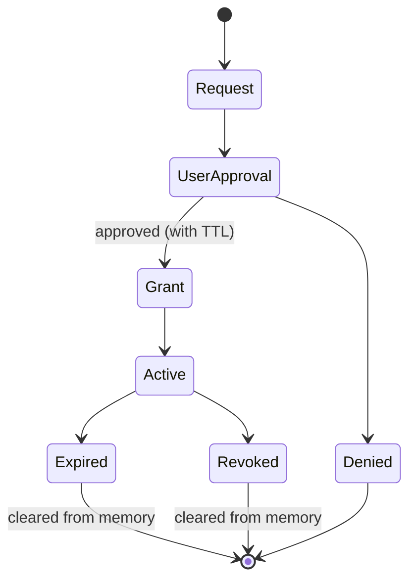
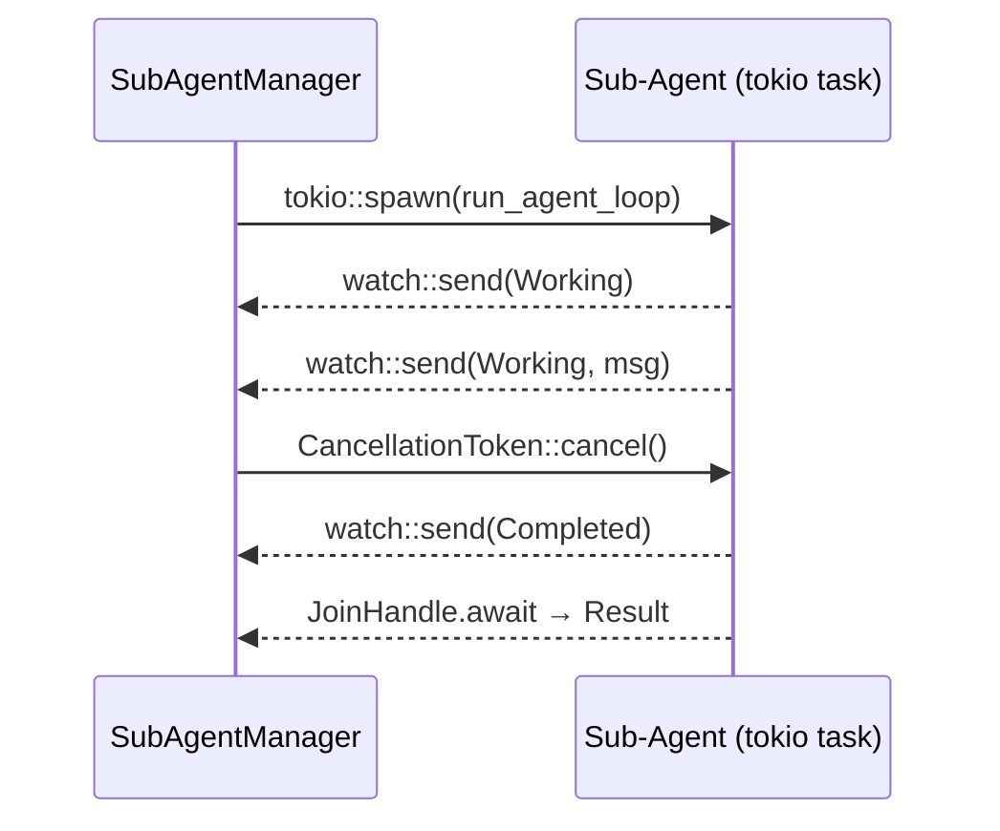

# Sub-Agent Orchestration

Sub-agents let you delegate tasks to specialized helpers that work in the background while you continue chatting with Zeph. Each sub-agent has its own system prompt, tools, and skills — but cannot access anything you haven't explicitly allowed.

## Quick Start

1. Create a definition file:

```markdown
+++
name = "code-reviewer"
description = "Reviews code for correctness and style"
+++

You are a code reviewer. Analyze the provided code for bugs, performance issues, and idiomatic style.
```

2. Save it to `.zeph/agents/code-reviewer.md` in your project (or `~/.config/zeph/agents/` for global use).

3. Spawn the sub-agent:

```
> /agent spawn code-reviewer Review the authentication module
Sub-agent 'code-reviewer' started (id: a1b2c3d4)
```

Or use the shorthand `@mention` syntax:

```
> @code-reviewer Review the authentication module
Sub-agent 'code-reviewer' started (id: a1b2c3d4)
```

That's it. The sub-agent works in the background and reports results when done.

## Managing Sub-Agents

| Command | Description |
|---------|-------------|
| `/agent list` | Show available sub-agent definitions |
| `/agent spawn <name> <prompt>` | Start a sub-agent with a task |
| `/agent bg <name> <prompt>` | Alias for `spawn` |
| `/agent status` | Show active sub-agents with state and progress |
| `/agent cancel <id>` | Cancel a running sub-agent (accepts ID prefix) |
| `/agent approve <id>` | Approve a pending secret request |
| `/agent deny <id>` | Deny a pending secret request |
| `@name <prompt>` | Shorthand for `/agent spawn` |

### Checking Status

```
> /agent status
Active sub-agents:
  [a1b2c3d4] working  turns=3  elapsed=42s  Analyzing auth flow...
```

### Cancelling

The `cancel` command accepts a UUID prefix. If the prefix is ambiguous (matches multiple agents), you'll be asked for a longer prefix:

```
> /agent cancel a1b2
Cancelled sub-agent a1b2c3d4-...
```

## Writing Definitions

A definition is a markdown file with TOML frontmatter between `+++` delimiters. The body after the closing `+++` becomes the sub-agent's system prompt.

### Minimal Definition

Only `name` and `description` are required. Everything else has sensible defaults:

```markdown
+++
name = "helper"
description = "General-purpose helper"
+++

You are a helpful assistant. Complete the given task concisely.
```

### Full Definition

```markdown
+++
name = "code-reviewer"
description = "Reviews code changes for correctness and style"
model = "claude-sonnet-4-20250514"

[tools]
allow = ["shell", "web_scrape"]

[permissions]
secrets = ["github-token"]
max_turns = 10
timeout_secs = 300
ttl_secs = 120

[skills]
include = ["git-*", "rust-*"]
exclude = ["deploy-*"]
+++

You are a code reviewer. Analyze the provided code for:
- Correctness bugs
- Performance issues
- Idiomatic Rust style

Report findings as a structured list with severity (critical/warning/info).
```

### Field Reference

| Field | Type | Default | Description |
|-------|------|---------|-------------|
| `name` | string | required | Unique identifier |
| `description` | string | required | Human-readable description |
| `model` | string | inherited | LLM model override |
| `tools.allow` | string[] | — | Only these tools are available (mutually exclusive with `deny`) |
| `tools.deny` | string[] | — | All tools except these (mutually exclusive with `allow`) |
| `permissions.secrets` | string[] | `[]` | Vault keys the agent MAY request |
| `permissions.max_turns` | u32 | `20` | Maximum LLM turns |
| `permissions.background` | bool | `false` | Run in background (fire-and-forget) |
| `permissions.timeout_secs` | u64 | `600` | Hard kill deadline |
| `permissions.ttl_secs` | u64 | `300` | TTL for granted permissions |
| `skills.include` | string[] | all | Glob patterns to include (`*` wildcard) |
| `skills.exclude` | string[] | `[]` | Glob patterns to exclude (takes precedence) |

If neither `tools.allow` nor `tools.deny` is specified, the sub-agent inherits all tools from the main agent.

### Definition Locations

| Path | Scope | Priority |
|------|-------|----------|
| `.zeph/agents/` | Project | Higher (wins on name conflict) |
| `~/.config/zeph/agents/` | User (global) | Lower |

## Tool and Skill Access

### Tool Filtering

Control which tools a sub-agent can use:

- **Allow list** — only listed tools are available: `allow = ["shell", "web_scrape"]`
- **Deny list** — all tools except listed: `deny = ["shell"]`
- **Inherit all** — omit both `allow` and `deny`

Filtering is enforced at the executor level. The sub-agent's LLM only sees tool definitions it can actually call. Blocked tool calls return an error.

### Skill Filtering

Skills are filtered by glob patterns with `*` wildcard:

```toml
[skills]
include = ["git-*", "rust-*"]   # only matching skills
exclude = ["deploy-*"]          # always excluded
```

- Empty `include` = all skills pass (unless excluded)
- `exclude` always takes precedence over `include`

## Security Model

Sub-agents follow a zero-trust principle: they start with **zero permissions** and can only access what you explicitly grant.

### How It Works

1. **Definitions declare capabilities, not permissions.** Writing `secrets = ["github-token"]` means the agent _may request_ that secret — it doesn't get it automatically.

2. **Secrets require your approval.** When a sub-agent needs a secret, Zeph prompts you:

   > Sub-agent 'code-reviewer' requests 'github-token' (TTL: 120s). Allow? [y/n]

3. **Everything expires.** Granted permissions and secrets are automatically revoked after `ttl_secs` or when the sub-agent finishes — whichever comes first.

4. **Secrets stay in memory only.** They are never written to disk, message history, or logs.

### Permission Lifecycle



### Safety Guarantees

- Concurrency limit prevents resource exhaustion
- `timeout_secs` provides a hard kill deadline
- `max_turns` prevents runaway LLM loops
- All grants are revoked on completion, cancellation, or crash
- Secret key names are redacted in logs

## TUI Dashboard Panel

When the `tui` feature is enabled, a Sub-Agents panel appears in the sidebar showing active agents with color-coded status:

```
┌ Sub-Agents (2) ──────────┐
│  code-reviewer  WORKING  │
│    3/20  42s             │
│  test-writer [bg]  COMPLETED │
│    10/20  100s           │
└──────────────────────────┘
```

Colors: yellow = working, green = completed, red = failed, cyan = input required.

## Architecture

Sub-agents run as in-process tokio tasks — not separate processes. The main agent communicates with them via lightweight primitives:



| Primitive | Direction | Purpose |
|-----------|-----------|---------|
| `watch::channel` | Agent → Manager | Real-time status updates |
| `JoinHandle` | Agent → Manager | Final result collection |
| `CancellationToken` | Manager → Agent | Graceful cancellation |

### `@mention` vs File References

The TUI uses `@` for both sub-agent mentions and file references. Zeph resolves ambiguity by checking the token after `@` against known agent names:

```
@code-reviewer review src/main.rs   → sub-agent mention
@src/main.rs                        → file reference
```

## API Reference

For programmatic use, `SubAgentManager` provides the full lifecycle API:

```rust
let mut manager = SubAgentManager::new(/* max_concurrent */ 4);

manager.load_definitions(&[
    project_dir.join(".zeph/agents"),
    dirs::config_dir().unwrap().join("zeph/agents"),
])?;

let task_id = manager.spawn("code-reviewer", "Review src/main.rs", provider, executor)?;
let statuses = manager.statuses();
manager.cancel(&task_id)?;
let result = manager.collect(&task_id).await?;
```

| Method | Description |
|--------|-------------|
| `load_definitions(&[PathBuf])` | Load `.md` definitions (first-wins deduplication) |
| `spawn(name, prompt, provider, executor)` | Spawn a sub-agent, returns task ID |
| `cancel(task_id)` | Cancel and revoke all grants |
| `collect(task_id)` | Await result and remove from active set |
| `statuses()` | Snapshot of all active sub-agent states |
| `approve_secret(task_id, key, ttl)` | Grant a vault secret after user approval |
| `shutdown_all()` | Cancel all active sub-agents (used on exit) |

### Error Types

| Variant | When |
|---------|------|
| `Parse` | Invalid frontmatter or TOML |
| `Invalid` | Validation failure (empty name, mutual exclusion) |
| `NotFound` | Unknown definition name or task ID |
| `Spawn` | Concurrency limit reached or task panic |
| `Cancelled` | Sub-agent was cancelled |
