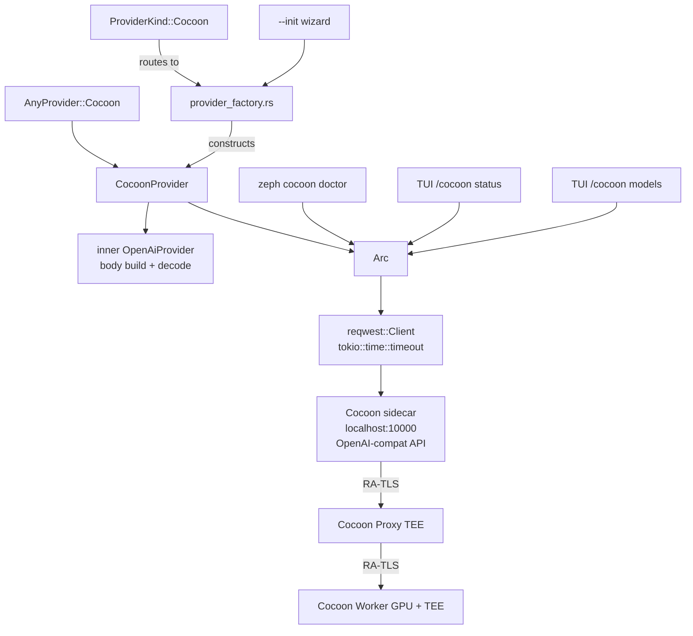

---
aliases:
  - Cocoon Technical Plan
  - CocoonProvider Plan
tags:
  - sdd
  - plan
  - llm
  - providers
  - tee
created: 2026-05-09
status: draft
related:
  - "[[spec]]"
  - "[[constitution]]"
  - "[[003-llm-providers/spec]]"
  - "[[022-config-simplification/spec]]"
  - "[[038-vault/spec]]"
  - "[[052-gonka-native/spec]]"
---

# Technical Plan: Cocoon Distributed Compute Integration

> [!info] References
> **Spec**: [[spec]]
> **Epic**: [#3681](https://github.com/bug-ops/zeph/issues/3681)

---

## 1. Architecture

### Approach

Cocoon speaks the OpenAI-compatible wire format through a localhost sidecar.
The implementation follows the same delegation pattern used by `GonkaProvider`:
an inner `OpenAiProvider` handles request body construction and response
decoding; `CocoonClient` provides the transport layer; `CocoonProvider`
composes them.

This approach has three advantages:
1. Zero new Cargo dependencies — `reqwest` is already in the workspace.
2. Full OpenAI request/response schema reuse — no bespoke serialisation.
3. Minimal surface area for RA-TLS/TEE trust reasoning — all attestation is
   opaque to Zeph, handled exclusively by the sidecar.

The feature is gated behind `--features cocoon` at both `zeph-llm` and
`zeph-core` crate level.

### Component Diagram



### Key Design Decisions

| Decision | Choice | Rationale | Alternatives Considered |
|----------|--------|-----------|------------------------|
| Delegation to inner `OpenAiProvider` | Yes — same as `GonkaProvider` | DRY; sidecar is OpenAI-compat | Write bespoke serialiser — rejected: duplication with no benefit |
| New crate vs. extend `zeph-llm` | Extend `zeph-llm` with `cocoon` module | No new inter-crate dep; keeps provider logic co-located | New crate — rejected: overkill, would add a Layer 0 crate for minimal code |
| `CocoonClient` separate from `CocoonProvider` | Yes | Allows `doctor` command and TUI commands to call transport independently of `LlmProvider` | Embed client in provider — rejected: prevents reuse by CLI/TUI |
| `Arc<CocoonClient>` in provider | Yes | `CocoonProvider` and `doctor`/TUI commands share one client | Clone per caller — rejected: wastes connection pool |
| Feature flag granularity | `cocoon` flag at `zeph-llm` + `zeph-core` | Mirrors existing `gonka` pattern; other crates unchanged | Single top-level flag only — accepted as equivalent; bottom-up flag is cleaner |
| `embed` support | Attempt delegation; fall back to `Unsupported` | Sidecar may or may not serve embedding models | Always `Unsupported` — rejected: unnecessarily restricts capability |

---

## 2. Project Structure

New files:

```
crates/zeph-llm/src/cocoon/
├── mod.rs        — pub use re-exports; #[cfg(feature = "cocoon")] gate
├── client.rs     — CocoonClient, CocoonHealth
├── provider.rs   — CocoonProvider, LlmProvider impl
└── tests.rs      — unit tests (mock server via wiremock)

src/cli/
└── cocoon.rs     — `zeph cocoon doctor` subcommand

src/init/
└── llm.rs        — (modified) new Cocoon wizard branch
```

Modified files:

```
crates/zeph-llm/src/any.rs              — AnyProvider::Cocoon variant
crates/zeph-llm/src/lib.rs              — pub mod cocoon (feature-gated)
crates/zeph-config/src/providers.rs     — ProviderKind::Cocoon + ProviderEntry fields
crates/zeph-core/src/provider_factory.rs — ProviderKind::Cocoon build arm
src/main.rs (or cli/mod.rs)             — register `cocoon` subcommand
src/init/llm.rs                         — Cocoon wizard branch
config/default.toml                     — commented example stanza
Cargo.toml (root + zeph-llm + zeph-core) — `cocoon` feature declarations
```

---

## 3. Data Model

### Config Types

```rust
// crates/zeph-config/src/providers.rs

#[derive(Debug, Clone, Deserialize, Serialize, JsonSchema, PartialEq)]
#[serde(rename_all = "lowercase")]
pub enum ProviderKind {
    // ... existing variants ...
    Cocoon,   // new
}

// Fields added to ProviderEntry (all optional / defaulted):
pub cocoon_client_url:   Option<String>,   // default "http://localhost:10000"
pub cocoon_access_hash:  Option<String>,   // sentinel only; real value from vault
pub cocoon_health_check: bool,             // #[serde(default = "default_true")]
```

### Runtime Types

```rust
// crates/zeph-llm/src/cocoon/client.rs

pub struct CocoonClient {
    base_url:    String,
    access_hash: Option<String>,   // resolved from vault at construction
    client:      reqwest::Client,
    timeout:     Duration,
}

pub struct CocoonHealth {
    pub proxy_connected: bool,
    pub worker_count:    u32,
}

// crates/zeph-llm/src/cocoon/provider.rs

pub struct CocoonProvider {
    inner:     OpenAiProvider,
    client:    Arc<CocoonClient>,
    usage:     UsageTracker,
    pub(crate) status_tx: Option<StatusTx>,
}
```

### Sidecar API Surface (Consumed by Zeph)

| Endpoint | Method | Used By |
|----------|--------|---------|
| `/stats` | GET | Health check, doctor, TUI status |
| `/v1/models` | GET | Model listing, doctor, TUI models |
| `/v1/chat/completions` | POST | chat, chat_stream, chat_with_tools, chat_typed |
| `/v1/embeddings` | POST | embed (attempt; fall back on 404) |

Expected `/stats` response shape (parsed defensively):
```json
{
  "proxy_connected": true,
  "worker_count": 3
}
```

---

## 4. API Design

### `CocoonClient` Public API

```rust
impl CocoonClient {
    /// Construct a new client. Does not perform I/O.
    pub fn new(
        base_url:    impl Into<String>,
        access_hash: Option<String>,
        timeout:     Duration,
    ) -> Self;

    /// Query GET /stats. Span: llm.cocoon.health
    pub async fn health_check(&self) -> Result<CocoonHealth, LlmError>;

    /// Query GET /v1/models. Span: llm.cocoon.models
    pub async fn list_models(&self) -> Result<Vec<String>, LlmError>;

    /// POST arbitrary body to path. Span: llm.cocoon.request
    /// Attaches X-Access-Hash header if access_hash is Some.
    pub async fn post(
        &self,
        path: &str,
        body: &[u8],
    ) -> Result<reqwest::Response, LlmError>;
}
```

### `AnyProvider` Addition

```rust
// crates/zeph-llm/src/any.rs
pub enum AnyProvider {
    // ... existing ...
    #[cfg(feature = "cocoon")]
    Cocoon(CocoonProvider),
}
```

### `provider_factory.rs` Addition

```rust
ProviderKind::Cocoon => {
    let client = build_cocoon_client(&entry, &vault)?;
    Ok(AnyProvider::Cocoon(CocoonProvider::new(entry, client, status_tx)?))
}
```

---

## 5. Feature Flag Declarations

### Root `Cargo.toml`

```toml
[features]
cocoon = ["zeph-llm/cocoon", "zeph-core/cocoon"]
```

### `crates/zeph-llm/Cargo.toml`

```toml
[features]
cocoon = []
```

### `crates/zeph-core/Cargo.toml`

```toml
[features]
cocoon = ["zeph-llm/cocoon"]
```

All Cocoon code in `zeph-llm` is gated with `#[cfg(feature = "cocoon")]`.
The `mod cocoon` declaration in `lib.rs` is likewise feature-gated.

---

## 6. Security Considerations

- `ZEPH_COCOON_ACCESS_HASH` is the only secret; it is loaded from the age vault
  by `provider_factory.rs` and stored in `CocoonClient.access_hash`. It must
  not appear in any log output.
- The sidecar manages all TON payment state, RA-TLS attestation, and TEE
  wallet operations. Zeph has zero visibility into these.
- All HTTP is to `localhost`; SSRF risks are minimal, but `cocoon_client_url`
  must not be overridable to a non-localhost address without explicit user action.
- The access hash header value must not be logged at `DEBUG` or lower.
- No `unsafe` blocks — constitution enforces `unsafe_code = "deny"`.

---

## 7. Testing Strategy

| Level | Framework | What to Test | Notes |
|-------|-----------|-------------|-------|
| Unit | `cargo nextest` + `wiremock` (already in workspace) | `CocoonClient::health_check`, `list_models`, `post`; `CocoonProvider` method routing; `CocoonHealth` parsing | Mock sidecar at localhost; no real Cocoon needed |
| Unit | `cargo nextest` | `ProviderKind::Cocoon` config deserialisation; `cocoon_health_check` default = true | Pure Rust, no I/O |
| Integration | `#[ignore]` + real sidecar | `CocoonProvider::chat` round-trip; streaming; doctor all-pass | Gated; requires local Cocoon sidecar |
| Compile | CI feature matrix | `cargo check --features cocoon`; `cargo check` (no cocoon) | Both must succeed with zero errors |
| Linting | clippy | `cargo clippy --features cocoon -- -D warnings` | Zero new warnings |

### Unit Test Scenarios

- `health_check` returns `CocoonHealth { proxy_connected: true, worker_count: 2 }` on HTTP 200 JSON
- `health_check` returns `LlmError::Unavailable` on connection refused
- `health_check` returns `LlmError::Timeout` when mock server hangs past timeout
- `list_models` parses OpenAI `/v1/models` response into `Vec<String>`
- `post` attaches `X-Access-Hash` header when `access_hash` is set
- `post` omits `X-Access-Hash` header when `access_hash` is `None`
- Doctor command table shows skip for vault check when access hash not configured
- Doctor exit code 0 when all applicable checks pass; 1 when any fail

---

## 8. Tracing Spans

All async I/O in the Cocoon module must use `tracing::info_span!`. Naming
convention follows `<crate_short>.<subsystem>.<operation>`:

| Span Name | Location | Triggered By |
|-----------|----------|-------------|
| `llm.cocoon.request` | `CocoonClient::post` | Every `/v1/chat/completions` or `/v1/embeddings` call |
| `llm.cocoon.health` | `CocoonClient::health_check` | Startup health check + doctor + TUI status |
| `llm.cocoon.models` | `CocoonClient::list_models` | Doctor + TUI models command |

---

## 9. Rollout Plan

Implementation is split across six phases (see [[tasks]]):

| Phase | Branch | Scope |
|-------|--------|-------|
| A | `feat/m28/3670-cocoon-provider` | Core provider, client, feature flag, AnyProvider, factory |
| B | `feat/m28/3671-cocoon-config` | Config fields, wizard, vault resolution, `--migrate-config` |
| C | `feat/m28/3672-cocoon-doctor` | `zeph cocoon doctor` CLI command |
| D | `feat/m28/3673-cocoon-tui` | TUI palette entries, spinners, TON balance sidebar |
| E | `docs/m28/3674-cocoon-spec` | spec.md, playbook, coverage-status update |
| F | `feat/m28/3675-cocoon-live` | Live integration tests (`#[ignore]`) |

Dependency chain: A → B → C → D (parallel with E) → F.

Each phase corresponds to one PR. Phases C and D can be reviewed in parallel
with E since E is documentation-only.

---

## 10. Constitution Compliance

| Principle | Status | Notes |
|-----------|--------|-------|
| Layer 0 placement of `zeph-llm` | Compliant | No new cross-layer imports; `cocoon` module is within `zeph-llm` |
| No new Cargo dependencies | Compliant | `reqwest` already in workspace |
| `unsafe_code = "deny"` | Compliant | No unsafe blocks introduced |
| Feature-gated optional capability | Compliant | `cocoon` feature flag required |
| All pub APIs have doc comments | Must enforce in implementation | PR checklist item |
| Tracing spans on async I/O | Compliant by design | Three named spans specified |
| `--init` wizard integration | Compliant | New wizard branch specified (FR-5) |
| `--migrate-config` integration | Compliant | No-op step specified (FR-6) |
| TUI spinner for background ops | Compliant | Spinner required for `/cocoon status` and `/cocoon models` |
| CHANGELOG.md update | Compliant | End of each phase |
| Age vault for secrets | Compliant | `ZEPH_COCOON_ACCESS_HASH` from vault only |

---

## 11. Risks and Mitigations

| Risk | Impact | Probability | Mitigation |
|------|--------|-------------|------------|
| Sidecar `/stats` JSON schema undocumented | Medium — health check parsing breaks on schema change | Medium | Parse defensively with `#[serde(deny_unknown_fields)]` disabled; only required fields |
| Sidecar not available during development | Medium — blocks integration testing | High | All integration tests behind `#[ignore]`; unit tests use mock server |
| OpenAI-compat wire format divergence in sidecar | High — all inference fails | Low | Check against sidecar release notes; add serialisation gate test per constitution |
| `embed` not supported by sidecar model | Low — only embedding callers affected | Medium | Return `LlmError::Unsupported` gracefully on 404; document in spec |
| Feature flag leakage (cocoon code visible without flag) | Medium — compile error on default build | Low | CI feature matrix checks both `--features cocoon` and no-flag build |

---

## See Also

- [[spec]] — feature specification
- [[tasks]] — implementation tasks
- [[MOC-specs]] — all specifications
- [[constitution]] — project-wide principles
- [[003-llm-providers/spec]] — `LlmProvider` trait contract
- [[022-config-simplification/spec]] — `[[llm.providers]]` provider registry
- [[052-gonka-native/spec]] — analogous native transport (implementation reference)
