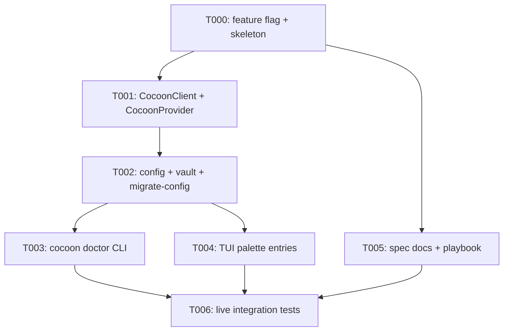

---
aliases:
  - Cocoon Tasks
  - CocoonProvider Implementation Tasks
tags:
  - sdd
  - tasks
  - llm
  - providers
  - tee
created: 2026-05-09
status: draft
related:
  - "[[spec]]"
  - "[[plan]]"
  - "[[constitution]]"
---

# Implementation Tasks: Cocoon Distributed Compute Integration

> [!info] References
> **Spec**: [[spec]]
> **Plan**: [[plan]]
> **Epic**: [#3681](https://github.com/bug-ops/zeph/issues/3681)
> **Total tasks**: 7 (T000–T006)

## Progress

- [ ] T000: Feature flag scaffolding and module skeleton
- [ ] T001: `CocoonClient` and `CocoonProvider` core implementation
- [ ] T002: Config fields, vault resolution, and `--migrate-config` no-op
- [ ] T003: `zeph cocoon doctor` CLI command
- [ ] T004: TUI palette entries and spinners
- [ ] T005: Spec documentation, playbook, and coverage-status
- [ ] T006: Live integration tests (`#[ignore]`)

---

## Dependency Graph

---

### T000: Feature Flag Scaffolding and Module Skeleton

**Context:** Establish the feature flag plumbing and empty module files so that
all subsequent tasks compile independently and the CI feature matrix can be
verified from the first commit.

**Spec reference:** [[spec#4-non-functional-requirements]] NFR-4 (feature compiles
cleanly with and without `--features cocoon`), [[spec#5-architecture]] module layout.

**Acceptance criteria:**
- [ ] `[features] cocoon = ["zeph-llm/cocoon", "zeph-core/cocoon"]` added to root `Cargo.toml`
- [ ] `[features] cocoon = []` added to `crates/zeph-llm/Cargo.toml`
- [ ] `[features] cocoon = ["zeph-llm/cocoon"]` added to `crates/zeph-core/Cargo.toml`
- [ ] `crates/zeph-llm/src/cocoon/mod.rs`, `client.rs`, `provider.rs`, `tests.rs` created as empty stubs (with `#![allow(dead_code)]` gated by `#[cfg(feature = "cocoon")]`)
- [ ] `#[cfg(feature = "cocoon")] pub mod cocoon;` added to `crates/zeph-llm/src/lib.rs`
- [ ] `cargo check` (no features) passes with zero errors
- [ ] `cargo check --features cocoon` passes with zero errors
- [ ] `cargo +nightly fmt --check` passes
- [ ] `cargo clippy --features cocoon -- -D warnings` passes

**Dependencies:** none
**Branch:** `feat/m28/3670-cocoon-provider`
**Issue:** [#3670](https://github.com/bug-ops/zeph/issues/3670)
**Files:**
- `Cargo.toml` (root)
- `crates/zeph-llm/Cargo.toml`
- `crates/zeph-core/Cargo.toml`
- `crates/zeph-llm/src/lib.rs`
- `crates/zeph-llm/src/cocoon/mod.rs` (new)
- `crates/zeph-llm/src/cocoon/client.rs` (new)
- `crates/zeph-llm/src/cocoon/provider.rs` (new)
- `crates/zeph-llm/src/cocoon/tests.rs` (new)
**Complexity:** low

---

### T001: `CocoonClient` and `CocoonProvider` Core Implementation

**Context:** Implement the transport layer and the `LlmProvider` implementation.
This is the central deliverable: after this task Cocoon inference is functional
end-to-end when a sidecar is running locally. Follows the delegation pattern from
`GonkaProvider` — inner `OpenAiProvider` handles request body and response decoding;
`CocoonClient` handles HTTP transport; `CocoonProvider` composes them.

**Spec reference:** [[spec#fr-1]] FR-1 (all `LlmProvider` methods), [[spec#fr-2]] FR-2
(health check at construction), [[spec#fr-3]] FR-3 (model listing),
[[spec#7-core-abstractions]], [[spec#11-key-invariants]], NFR-1 through NFR-5.

**Acceptance criteria:**
- [ ] `CocoonClient` implemented with `health_check`, `list_models`, and `post` methods
- [ ] `CocoonHealth { proxy_connected: bool, worker_count: u32 }` parsed from `/stats` JSON
- [ ] All `CocoonClient` calls wrapped in `tokio::time::timeout(self.timeout, …)` — no unbounded awaits
- [ ] `LlmError::Unavailable` returned (not panic) when sidecar is unreachable
- [ ] `CocoonProvider` implements all `LlmProvider` methods: `chat`, `chat_stream`, `embed`, `chat_with_tools`, `chat_typed`
- [ ] `embed` attempts delegation to sidecar `/v1/embeddings`; returns `LlmError::Unsupported` on 404
- [ ] `AnyProvider::Cocoon(CocoonProvider)` variant added (feature-gated) to `crates/zeph-llm/src/any.rs`
- [ ] `ProviderKind::Cocoon => build_cocoon_provider(entry, config)` arm added to `provider_factory.rs`
- [ ] Tracing spans present: `llm.cocoon.request`, `llm.cocoon.health`, `llm.cocoon.models`
- [ ] All pub types and methods have `///` doc comments
- [ ] Unit tests in `tests.rs` cover: `health_check` success, `health_check` timeout, `list_models` parse, `post` with and without access hash header
- [ ] `cargo nextest run --features cocoon -p zeph-llm` passes
- [ ] `cargo clippy --features cocoon -- -D warnings` passes with zero warnings
- [ ] `ZEPH_COCOON_ACCESS_HASH` value never appears in any log output during test runs

**Dependencies:** T000
**Branch:** `feat/m28/3670-cocoon-provider`
**Issue:** [#3670](https://github.com/bug-ops/zeph/issues/3670)
**Files:**
- `crates/zeph-llm/src/cocoon/client.rs`
- `crates/zeph-llm/src/cocoon/provider.rs`
- `crates/zeph-llm/src/cocoon/tests.rs`
- `crates/zeph-llm/src/cocoon/mod.rs`
- `crates/zeph-llm/src/any.rs`
- `crates/zeph-core/src/provider_factory.rs`
**Complexity:** high

---

### T002: Config Fields, Vault Resolution, and `--migrate-config` No-Op

**Context:** Wire the new config fields into `zeph-config` and connect vault
resolution so that `ZEPH_COCOON_ACCESS_HASH` is loaded from the age vault at
startup. Add the wizard branch for first-time setup. Register the no-op
`--migrate-config` step so existing configs continue to work.

**Spec reference:** [[spec#6-config-schema]] FR-5 (wizard), FR-6 (migrate-config),
FR-9 (vault key), FR-10 (absent access hash), [[plan#3-data-model]].

**Acceptance criteria:**
- [ ] `ProviderKind::Cocoon` variant added to `crates/zeph-config/src/providers.rs`
- [ ] `cocoon_client_url: Option<String>` added to `ProviderEntry` (default `"http://localhost:10000"`)
- [ ] `cocoon_access_hash: Option<String>` added to `ProviderEntry` (sentinel field; real value from vault)
- [ ] `cocoon_health_check: bool` added to `ProviderEntry` with `#[serde(default = "default_true")]`
- [ ] `ZEPH_COCOON_ACCESS_HASH` is read from the age vault in `provider_factory.rs` when `cocoon_access_hash` is non-empty in config; access hash value never logged
- [ ] `--init` wizard gains a "Cocoon" branch: prompts for sidecar URL → optional access hash → model probe → model selection → writes `[[llm.providers]]` stanza
- [ ] `--migrate-config` runs a no-op Cocoon step that succeeds on any existing config
- [ ] Commented-out example stanza added to `config/default.toml`
- [ ] Config round-trip unit test: TOML with `type = "cocoon"` deserialises to `ProviderKind::Cocoon`
- [ ] `cocoon_health_check` defaults to `true` when absent from TOML
- [ ] `cargo nextest run --features cocoon` passes
- [ ] `cargo +nightly fmt --check` passes

**Dependencies:** T001
**Branch:** `feat/m28/3671-cocoon-config`
**Issue:** [#3671](https://github.com/bug-ops/zeph/issues/3671)
**Files:**
- `crates/zeph-config/src/providers.rs`
- `crates/zeph-core/src/provider_factory.rs`
- `src/init/llm.rs`
- `src/cli/migrate_config.rs` (or equivalent migrate-config handler)
- `config/default.toml`
**Complexity:** medium

---

### T003: `zeph cocoon doctor` CLI Command

**Context:** Implement the six-check diagnostic command that gives users
immediate feedback on their Cocoon setup. This command is the primary
onboarding tool and the first line of debug support.

**Spec reference:** [[spec#fr-4]] FR-4, [[spec#8-doctor-command-health-checks]],
[[plan#api-design]].

**Acceptance criteria:**
- [ ] `zeph cocoon doctor [--json] [--timeout-secs N]` subcommand implemented in `src/cli/cocoon.rs`
- [ ] All six checks execute in order: config present, sidecar reachable, proxy connected, workers available, model listed, vault key (skipped with `- skipped` if access hash not configured)
- [ ] Output is a formatted pass/fail table with timing (ms) for network checks
- [ ] `--json` flag emits JSONL with one object per check: `{ "check": "...", "status": "pass"|"fail"|"skip", "detail": "..." }`
- [ ] Exit code 0 if all applicable checks pass; exit code 1 if any fail
- [ ] Vault key check uses `ZEPH_COCOON_ACCESS_HASH` — not plain config field
- [ ] `--timeout-secs N` overrides the network check timeout (default 5 s for doctor, distinct from provider's 30 s inference timeout)
- [ ] Subcommand registered in `src/main.rs` (or `src/cli/mod.rs`) under `zeph cocoon`
- [ ] Unit test: mock sidecar returns healthy `/stats` → all checks pass → exit 0
- [ ] Unit test: sidecar unreachable → sidecar reachable check fails → exit 1
- [ ] `cargo nextest run --features cocoon` passes
- [ ] `cargo clippy --features cocoon -- -D warnings` passes

**Dependencies:** T002
**Branch:** `feat/m28/3672-cocoon-doctor`
**Issue:** [#3672](https://github.com/bug-ops/zeph/issues/3672)
**Files:**
- `src/cli/cocoon.rs` (new)
- `src/main.rs` or `src/cli/mod.rs`
**Complexity:** medium

---

### T004: TUI Palette Entries and Spinners

**Context:** Expose Cocoon status and model listing directly in the TUI command
palette. The sidecar's TON balance (if present in `/stats`) should be surfaced
in the sidebar. All background I/O must be accompanied by a spinner per
the TUI spinner rule in the constitution.

**Spec reference:** [[spec#fr-7]] FR-7, [[spec#fr-8]] FR-8, [[spec#9-integration-points]]
TUI row; [[constitution]] — "All background operations in TUI must have a visible
spinner with a descriptive status message."

**Acceptance criteria:**
- [ ] `/cocoon status` command registered in the TUI command palette
- [ ] `/cocoon models` command registered in the TUI command palette
- [ ] Spinner with message `"Querying Cocoon sidecar…"` displayed during `/cocoon status`
- [ ] Spinner with message `"Fetching Cocoon model list…"` displayed during `/cocoon models`
- [ ] `/cocoon status` renders `proxy_connected` and `worker_count` in the TUI status area after query completes
- [ ] `/cocoon models` renders the model list (one per line) after query completes
- [ ] If `/stats` response contains a `ton_balance` field, it is rendered in the TUI sidebar (graceful no-op if absent)
- [ ] Both commands are no-ops (with an informative message) when `cocoon` feature is not compiled in
- [ ] `cargo nextest run --features cocoon,tui` passes
- [ ] TUI commands do not block the main render loop (spawned as async tasks)

**Dependencies:** T002
**Branch:** `feat/m28/3673-cocoon-tui`
**Issue:** [#3673](https://github.com/bug-ops/zeph/issues/3673)
**Files:**
- `crates/zeph-tui/src/commands/cocoon.rs` (new or added to existing command module)
- `crates/zeph-tui/src/commands/mod.rs`
- `crates/zeph-tui/src/app.rs` (sidebar rendering)
**Complexity:** medium

---

### T005: Spec Documentation, Playbook, and Coverage Status

**Context:** Documentation-only phase. Write the live-testing playbook for
the Cocoon integration and register the new components in the coverage-status
master table. This task can proceed in parallel with T003 and T004.

**Spec reference:** [[spec]] (source of truth), [[plan]], project CLAUDE.md §
"Points 6 and 7 are MANDATORY."

**Acceptance criteria:**
- [ ] `.local/testing/playbooks/cocoon.md` created with concrete test scenarios, expected outcomes, and known edge cases for all six phases
- [ ] Coverage-status master table (`/Users/rabax/Dev/zeph/.local/testing/coverage-status.md`) has new rows for: `CocoonClient`, `CocoonProvider`, `cocoon doctor`, `TUI /cocoon status`, `TUI /cocoon models`, `--init wizard Cocoon branch`, all with status `Untested` and a link to the playbook
- [ ] `specs/055-cocoon/spec.md` complete and consistent with implemented behaviour (this file)
- [ ] `specs/055-cocoon/plan.md` complete (this file)
- [ ] `specs/README.md` updated with the `055-cocoon` entry
- [ ] No broken wikilinks in any of the three spec files

**Dependencies:** T000
**Branch:** `docs/m28/3674-cocoon-spec`
**Issue:** [#3674](https://github.com/bug-ops/zeph/issues/3674)
**Files:**
- `.local/testing/playbooks/cocoon.md` (new)
- `.local/testing/coverage-status.md` (updated in place)
- `specs/055-cocoon/spec.md`
- `specs/055-cocoon/plan.md`
- `specs/055-cocoon/tasks.md`
- `specs/README.md`
**Complexity:** low

---

### T006: Live Integration Tests (`#[ignore]`)

**Context:** Add `#[ignore]`-gated integration tests that exercise the full
round-trip against a real Cocoon sidecar. These tests are not run in CI unless
the environment is explicitly configured, but they serve as the canonical
acceptance test for production readiness.

**Spec reference:** [[spec#15-open-questions]] (live sidecar required),
[[plan#7-testing-strategy]] integration row; [[constitution]] III — "Integration tests
(require external services): `cargo nextest run -- --ignored`."

**Acceptance criteria:**
- [ ] `cocoon::integration::test_chat_round_trip` — sends a minimal one-turn chat; asserts non-empty response; requires `COCOON_TEST_URL` env var
- [ ] `cocoon::integration::test_chat_stream` — streams a one-turn completion; asserts at least one token received
- [ ] `cocoon::integration::test_chat_with_tools` — sends a tool-enabled request with a simple tool definition; asserts tool call in response
- [ ] `cocoon::integration::test_list_models` — calls `CocoonClient::list_models`; asserts non-empty list
- [ ] `cocoon::integration::test_health_check` — calls `CocoonClient::health_check`; asserts `proxy_connected = true`
- [ ] `cocoon::integration::test_doctor_all_pass` — runs doctor checks programmatically; asserts exit 0
- [ ] All integration tests carry `#[ignore]` attribute and `#[cfg(feature = "cocoon")]`
- [ ] Tests skip gracefully (via `env::var("COCOON_TEST_URL").is_err()`) rather than panic when env not set
- [ ] `cargo nextest run --features cocoon --ignored` passes when a sidecar is available
- [ ] `cargo nextest run --features cocoon` (no `--ignored`) passes in CI without a sidecar

**Dependencies:** T003, T004, T005
**Branch:** `feat/m28/3675-cocoon-live`
**Issue:** [#3675](https://github.com/bug-ops/zeph/issues/3675)
**Files:**
- `crates/zeph-llm/src/cocoon/tests.rs` (integration test module added)
- `src/cli/cocoon.rs` (doctor integration test helper if needed)
**Complexity:** medium

---

## Implementation Notes

### Order of Execution

The dependency chain is strictly linear for the core: T000 → T001 → T002 → T003/T004 (parallel) → T006. T005 (docs) can be written concurrently with T003/T004 and merged independently.

Recommended PR order:
1. T000 + T001 merged together as one PR (`feat/m28/3670-cocoon-provider`)
2. T002 as the next PR (`feat/m28/3671-cocoon-config`)
3. T003 and T004 can be reviewed in parallel; merge in whichever completes first
4. T005 merged independently (docs branch, no Rust changes)
5. T006 last, after all other phases land

### Common Patterns to Follow

- **Inner provider delegation**: follow `crates/zeph-llm/src/gonka/provider.rs` exactly for the `OpenAiProvider` delegation pattern
- **Feature gating**: follow `#[cfg(feature = "gonka")]` guard usage in `any.rs` and `lib.rs`
- **Vault resolution**: follow `provider_factory.rs` existing vault lookup calls for `ZEPH_GONKA_PRIVATE_KEY`
- **Timeout wrapping**: every `await` on a network call must be `tokio::time::timeout(…).await` — no exceptions
- **Doctor command structure**: follow `src/cli/gonka.rs` for the pass/fail table format and exit code pattern

### Gotchas

- `cocoon_health_check` defaults to `true` — the `#[serde(default = "default_true")]` attribute is required on the `ProviderEntry` field; omitting it causes the field to default to `false` via `bool`'s `Default`
- The `AnyProvider::Cocoon` variant must be gated with `#[cfg(feature = "cocoon")]`; omitting the gate causes a compile error when the feature is disabled
- `/stats` JSON may contain undocumented fields — use `#[serde(deny_unknown_fields)]` only on inner structs you fully control; parse sidecar responses with `flatten` or `ignore_unknown_fields`
- `embed` should attempt the request and return `LlmError::Unsupported` only on HTTP 404 — not unconditionally. Some Cocoon-served models may support embeddings.
- The doctor command uses a 5 s network timeout (not the provider's 30 s) — make the timeout configurable via `--timeout-secs` rather than hardcoding

## See Also

- [[spec]] — feature specification
- [[plan]] — technical plan
- [[MOC-specs]] — all specifications
- [[constitution]] — project-wide principles
- [[052-gonka-native/spec]] — GonkaProvider implementation reference
