---
aliases:
  - Specs Architecture
  - Dependency Map
  - Specs Dependency Graph
tags:
  - sdd
  - architecture
  - reference
created: 2026-04-10
status: reference
related:
  - "[[MOC-specs]]"
  - "[[001-system-invariants/spec]]"
---

# Specs Architecture: Dependency Graph

## Dependency Graph (Mermaid)

```mermaid
graph TB
    001["001: System Invariants<br/>(contracts for everything)"]
    
    002["002: Agent Loop<br/>(turn lifecycle)"]
    003["003: LLM Providers"]
    022["022: Config Simplification<br/>(provider registry)"]
    023["023: Complexity Triage<br/>(routing)"]
    024["024: Multi-Model Design"]
    004["004: Memory<br/>(SQLite + Qdrant)"]
    012["012: Graph Memory<br/>(entity graph)"]
    005["005: Skills<br/>(SKILL.md, hot-reload)"]
    015["015: Self-Learning<br/>(feedback, Wilson score)"]
    009["009: Orchestration<br/>(DAG planning)"]
    
    007["007: Channels<br/>(I/O trait)"]
    011["011: TUI<br/>(ratatui dashboard)"]
    026["026: TUI Subagents<br/>(sidebar)"]
    030["030: TUI Autocomplete<br/>(slash commands)"]
    
    006["006: Tools<br/>(ToolExecutor)"]
    016["016: Output Filtering<br/>(security patterns)"]
    008["008: MCP<br/>(client + server)"]
    010["010: Security<br/>(vault, isolation)"]
    025["025: Classifiers<br/>(injection, PII)"]
    
    020["020: Config Loading<br/>(resolution order)"]
    029["029: Feature Flags<br/>(cargo features)"]
    031["031: Database<br/>(SQLite + PostgreSQL)"]
    018["018: Scheduler<br/>(cron tasks)"]
    028["028: Hooks<br/>(cwd, file events)"]
    017["017: Index<br/>(AST, semantic search)"]
    019["019: Gateway<br/>(webhooks)"]
    
    013["013: ACP<br/>(Agent Control)"]
    014["014: A2A<br/>(Agent-to-Agent)"]
    027["027: RuntimeLayer<br/>(middleware hooks)"]
    032["032: Handoff<br/>(skill exchange)"]
    033["033: Subagent Context<br/>(gap analysis)"]
    034["034: Benchmark<br/>(zeph-bench)"]
    
    %% Layer 0 → Layer 1 (core foundation)
    001 --> 002
    001 --> 003
    001 --> 004
    001 --> 005
    001 --> 006
    001 --> 007
    
    %% Layer 1: Agent Core
    002 --> 003
    002 --> 004
    002 --> 005
    002 --> 009
    003 --> 022
    003 --> 023
    003 --> 024
    004 --> 012
    005 --> 015
    009 --> 023
    
    %% Layer 2: Channels & I/O
    002 --> 007
    007 --> 011
    011 --> 026
    011 --> 030
    
    %% Layer 3: Tools & Security
    002 --> 006
    006 --> 016
    006 --> 008
    008 --> 010
    006 --> 025
    010 --> 025
    
    %% Layer 4: Infrastructure
    002 --> 020
    002 --> 031
    002 --> 018
    002 --> 017
    002 --> 019
    020 --> 029
    018 --> 028
    017 --> 004
    
    %% Bidirectional relationships (dotted)
    004 -.->|graph integration| 012
    022 -.->|routing logic| 023
    026 -.->|lifecycle| 027
    005 -.->|skill exchange| 032
    015 -.->|feedback signals| 025
    018 -.->|event triggers| 028
    020 -.->|feature resolution| 029
    
    %% Cross-cutting protocols
    002 --> 013
    002 --> 014
    002 --> 027
    026 -.->|context| 033
    009 --> 032
    
    %% Styling by layer
    classDef layer0 fill:#ff6b6b,stroke:#c92a2a,color:#fff,font-weight:bold
    classDef layer1 fill:#4c6ef5,stroke:#364fc7,color:#fff
    classDef layer2 fill:#15aabf,stroke:#0b7285,color:#fff
    classDef layer3 fill:#a3e635,stroke:#5c940d,color:#000
    classDef layer4 fill:#ffa94d,stroke:#d9480f,color:#000
    classDef crosscutting fill:#e599f7,stroke:#9c36b5,color:#000
    
    class 001 layer0
    class 002,003,004,005,009,012,015,022,023,024 layer1
    class 007,011,026,030 layer2
    class 006,008,016,010,025 layer3
    class 020,029,031,018,028,017,019 layer4
    class 013,014,027,032,033,034 crosscutting
```



---

## Layer Breakdown

---

## Dependency Summary Table

| Layer | Specs | Purpose | Key Contracts |
|-------|-------|---------|---|
| **0** | 001 | Contracts & invariants | System-wide rules |
| **1** | 002, 003, 004, 005, 009, 012, 015, 022, 023, 024 | Agent loop & reasoning | LLM, memory, skills, orchestration |
| **2** | 007, 011, 026, 030 | I/O & user interaction | Channel trait, TUI widgets |
| **3** | 006, 008, 016, 010, 025 | Tool execution & safety | ToolExecutor trait, security gates |
| **4** | 020, 029, 031, 018, 028, 017, 019 | Infrastructure | Config, persistence, hooks |
| **X** | 013, 014, 027, 032, 033, 034 | Protocols & integration | ACP, A2A, handoff, benchmarks |

---

## Bidirectional Links (Peer Dependencies)

Specs that reference each other (not purely hierarchical):

```
004 ↔ 012     Memory ↔ Graph (graph is integrated with memory)
022 ↔ 023     Provider Registry ↔ Complexity Triage (routing)
009 ↔ 023     Orchestration ↔ Complexity Triage (DAG routing)
026 ↔ 027     TUI Subagents ↔ RuntimeLayer (lifecycle hooks)
020 ↔ 029     Config Loading ↔ Feature Flags (resolution)
010 ↔ 025     Security ↔ ML Classifiers (security signals)
015 ↔ 025     Self-Learning ↔ ML Classifiers (feedback)
005 ↔ 032     Skills ↔ Handoff Protocol (skill exchange)
017 ↔ 004     Code Index ↔ Memory (context injection)
018 ↔ 028     Scheduler ↔ Hooks (event triggers)
```

---

## How to Read This Map

### For Understanding Architecture

1. **Start at Layer 0** — read [[001-system-invariants/spec]] to understand non-negotiable contracts
2. **Layer 1** is the **agent heart** — how reasoning, memory, and skills work together
3. **Layer 2** is **user interaction** — how input reaches the agent and output leaves
4. **Layer 3** is **execution safety** — tools, security gates, and permission models
5. **Layer 4** is **infrastructure** — persistence, scheduling, indexing, configuration
6. **Layer X** is **integration glue** — protocols, multi-agent handoff, performance testing

### For Planning Features

- **New reasoning feature?** → Modify [[002-agent-loop/spec|Layer 1]]
- **New input channel?** → Add to [[007-channels/spec|Layer 2]]
- **New security gate?** → Add to [[010-security/spec|Layer 3]]
- **New persistence backend?** → Modify [[031-database-abstraction/spec|Layer 4]]
- **Multi-agent coordination?** → Extend [[032-handoff-skill-system/spec|Layer X]]

### For Debugging

Trace the dependency chain backward from the failing component:
- **TUI widget broken?** → Check [[007-channels/spec|Channel trait]]
- **Tool not executing?** → Check [[006-tools/spec|ToolExecutor trait]]
- **Memory not persisting?** → Check [[031-database-abstraction/spec|Database]] and [[020-config-loading/spec|Config]]
- **Subagent spawning fails?** → Check [[033-subagent-context-propagation/spec|Context propagation]]

### For Onboarding

Read in this order:
1. [[001-system-invariants/spec]] — establish mental model of contracts
2. [[002-agent-loop/spec]] — understand main control flow
3. Your domain layer (1–4) — drill into the subsystem you're working on
4. Related specs via the dependency graph — understand integration points

---

## Legend

```
┌─────┐
│ NNN │ = Spec ID and title
└─────┘

    │
    ▼     = Depends on (reads/calls)

    ↔     = Bidirectional dependency (peer relationship)

    ┌─┐
    │─├─┬─ = Fan-out (multiple specs depend on this one)
    └─┘
```

---

## See Also

- [[MOC-specs]] — complete specs index with descriptions
- [[constitution]] — project-wide non-negotiable principles
- [[TEMPLATE.md]] — template for creating new specs
