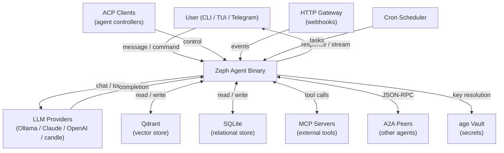

---
aliases:
  - "Zeph SRS"
  - "Zeph Functional Spec"
tags:
  - srs
  - requirements/functional
  - ai-agent
  - rust
  - status/draft
created: 2026-04-13
project: "Zeph"
status: draft
standard: "ISO/IEC/IEEE 29148:2018"
related:
  - "[[BRD]]"
  - "[[NFR]]"
  - "[[constitution]]"
  - "[[MOC-specs]]"
---

# Zeph: Software Requirements Specification

> [!abstract]
> Functional requirements specification for Zeph.
> Based on ISO/IEC/IEEE 29148:2018. Traceable to [[BRD]].
> Requirements are derived from the 44 feature specs in `/specs/` and the
> system invariants in [[001-system-invariants/spec]].

---

## 1. Introduction

### 1.1 Purpose

This document specifies the functional requirements for Zeph — a lightweight,
open-source, self-hostable Rust AI agent. It is intended for:

- Coding agents implementing features (primary audience)
- Contributors reviewing scope
- Researchers comparing Zeph capabilities against reference agents

The document covers Zeph pre-v1.0 and will be updated at each milestone.

### 1.2 Scope

Zeph is a single-binary Rust application exposing an AI agent across CLI, TUI,
and Telegram channels. It orchestrates multiple LLM backends, a skills system,
semantic memory, tool execution, MCP client, A2A / ACP protocols, a vault for
secrets, an HTTP gateway, a cron scheduler, and a code indexer.

This SRS specifies what the system shall do. Quality targets (latency,
reliability, security thresholds) are in [[NFR]].

### 1.3 Definitions, Acronyms, and Abbreviations

| Term | Definition |
|------|-----------|
| Agent | Zeph runtime instance managing one user session |
| EARS | Easy Approach to Requirements Syntax (`WHEN … THE SYSTEM SHALL …`) |
| MCP | Model Context Protocol — standard for LLM tool servers |
| A2A | Agent-to-Agent — JSON-RPC 2.0 inter-agent protocol |
| ACP | Agent Control Protocol — session-oriented agent control transport |
| TUI | Terminal User Interface (ratatui dashboard) |
| SKILL.md | Markdown file encoding one agent skill |
| BM25 | Sparse text ranking algorithm |
| Qdrant | Vector database used for semantic recall |
| age | File encryption tool used for the vault backend |
| DAG | Directed Acyclic Graph |
| IBCT | Invocation-Bound Capability Token |
| HMAC | Hash-based Message Authentication Code |
| IPI | Indirect Prompt Injection |
| PII | Personally Identifiable Information |
| SSRF | Server-Side Request Forgery |
| OAP | Operator Authorization Policy |
| TAFC | Tool-Argument Format Checker |
| MMR | Maximum Marginal Relevance |
| GAAMA | Graph-Augmented Adaptive Memory Architecture |
| BATS | Budget-Aware Token Scheduling |
| VMAO | Value-Maximising Adaptive Orchestration |

### 1.4 References

- [[BRD]] — Business Requirements Document
- [[NFR]] — Non-Functional Requirements Specification
- [[constitution]] — Project-wide non-negotiable principles
- [[001-system-invariants/spec]] — Architectural invariants (authoritative)
- [[002-agent-loop/spec]] — Agent loop spec
- [[003-llm-providers/spec]] — LLM providers spec
- [[004-memory/spec]] — Memory pipeline spec
- [[005-skills/spec]] — Skills system spec
- [[006-tools/spec]] — Tool execution spec
- [[007-channels/spec]] — Channel system spec
- [[008-mcp/spec]] — MCP client spec
- [[009-orchestration/spec]] — Orchestration spec
- [[010-security/spec]] — Security spec
- [[011-tui/spec]] — TUI dashboard spec
- [[012-graph-memory/spec]] — Entity graph spec
- [[013-acp/spec]] — ACP spec
- [[014-a2a/spec]] — A2A spec
- [[015-self-learning/spec]] — Self-learning spec
- [[016-output-filtering/spec]] — Output filtering spec
- [[017-index/spec]] — Code indexing spec
- [[018-scheduler/spec]] — Scheduler spec
- [[019-gateway/spec]] — Gateway spec
- [[020-config-loading/spec]] — Config loading spec
- [[021-zeph-context/spec]] — Context crate spec
- [[022-config-simplification/spec]] — Provider registry spec
- [[023-complexity-triage-routing/spec]] — Complexity routing spec
- [[024-multi-model-design/spec]] — Multi-model design spec
- [[025-classifiers/spec]] — ML classifiers spec
- [[026-tui-subagent-management/spec]] — TUI subagent sidebar spec
- [[027-runtime-layer/spec]] — Runtime layer spec
- [[028-hooks/spec]] — Hooks spec
- [[029-feature-flags/spec]] — Feature flags spec
- [[030-tui-slash-autocomplete/spec]] — TUI slash autocomplete spec
- [[031-database-abstraction/spec]] — Database abstraction spec
- [[032-handoff-skill-system/spec]] — Handoff protocol spec
- [[033-subagent-context-propagation/spec]] — Subagent context spec
- [[034-zeph-bench/spec]] — Benchmark harness spec
- [[035-profiling/spec]] — Profiling spec
- [[036-prometheus-metrics/spec]] — Prometheus metrics spec
- [[037-config-schema/spec]] — Config schema spec
- [[038-vault/spec]] — Vault spec
- [[039-background-task-supervisor/spec]] — Background task supervisor spec
- [[040-sanitizer/spec]] — Content sanitizer spec
- [[041-experiments/spec]] — Experiments spec
- [[042-zeph-commands/spec]] — Slash command registry spec
- [[043-zeph-common/spec]] — Shared primitives spec
- [[044-subagent-lifecycle/spec]] — Subagent lifecycle spec

### 1.5 Document Overview

Section 2 describes the system context, user classes, and operating environment.
Section 3 contains all functional requirements grouped by subsystem, using EARS
notation. Section 4 presents the verification matrix. Section 5 contains the
traceability matrix.

---

## 2. Overall Description

### 2.1 Product Perspective

Zeph is a standalone binary that sits between the user (via CLI, TUI, or Telegram)
and one or more LLM providers. It mediates skill injection, tool execution, memory
read/write, MCP server connections, and optional gateway / scheduler services.

### 2.2 Product Functions

Major functional areas:

- **Agent loop** — single-threaded async turn lifecycle
- **LLM provider abstraction** — unified interface over multiple backends
- **Skills system** — SKILL.md registry with hot-reload and hybrid matching
- **Semantic memory** — SQLite + Qdrant dual-backend with graph recall
- **Channel system** — CLI, TUI, and Telegram I/O channels
- **Tool execution** — shell, web, file tools with permission gates
- **MCP integration** — multi-server MCP client with semantic discovery
- **A2A / ACP protocols** — inter-agent communication
- **Vault & secrets** — age-encrypted secret storage
- **Slash command dispatch** — extensible `/` command registry
- **Subagent lifecycle** — scoped child agents with permission grants
- **Code indexing** — AST-based codebase retrieval
- **Gateway** — HTTP webhook ingestion
- **Scheduler** — cron-based periodic task execution
- **Observability** — profiling, Prometheus metrics, structured logging

### 2.3 User Classes and Characteristics

| User Class | Description | Proficiency | Frequency |
|-----------|-------------|-------------|-----------|
| CLI Developer | Uses Zeph in shell, pipes output, writes skills | High | Daily |
| Power User (TUI) | Runs Zeph in ratatui TUI for full situational awareness | High | Daily |
| Remote User (Telegram) | Accesses Zeph from mobile via Telegram bot | Medium | Daily |
| Team Operator | Deploys Zeph as a service, manages gateway/scheduler/metrics | High | Weekly |
| Skill Author | Writes SKILL.md files to teach domain knowledge | Medium | Occasional |
| Benchmark Researcher | Runs Zeph against standard benchmarks | High | Occasional |

### 2.4 Operating Environment

- OS: macOS 13+, Linux (glibc 2.31+); Windows not supported.
- Architecture: x86_64, aarch64.
- Runtime: single Rust binary; no Python, Node.js, or JVM required.
- LLM dependency: at least one provider configured (Ollama local or cloud API key).
- Optional: Qdrant 1.x for vector memory; PostgreSQL 15+ for alternative DB backend.
- Network: outbound HTTPS to cloud LLM APIs; local TCP to Ollama / Qdrant.

### 2.5 Design and Implementation Constraints

- Rust 1.94 (MSRV), Edition 2024; `unsafe_code = "deny"` workspace-wide.
- Async: tokio; no `async-trait` crate in library crates.
- TLS: rustls; `openssl-sys` banned.
- Crate layering: `zeph-core` orchestrates all leaf crates; same-layer imports prohibited.
- Feature flags: `default = []`; bundles (`desktop`, `ide`, `server`, `full`) for CI.
- Binary size: release binary ≤ 15 MiB.
- No blocking I/O in async hot paths.

### 2.6 Assumptions and Dependencies

> [!warning] Assumptions
> - Users configure at least one LLM provider before first run.
> - The age vault is initialised before secrets are needed; the agent fails
>   gracefully (logged error, not panic) if the vault is absent.
> - Qdrant is optional; the agent degrades to SQLite-only memory.
> - Telegram channel requires a valid bot token in the vault.
> - MCP servers are user-managed external processes; Zeph is not responsible
>   for their availability.

---

## 3. Specific Requirements

### 3.1 External Interface Requirements

#### 3.1.1 User Interfaces

- **CLI**: line-oriented stdin/stdout; supports piped input and TTY mode.
- **TUI**: ratatui full-screen terminal dashboard; requires a compatible terminal
  emulator (xterm-compatible, 256-colour or truecolour).
- **Telegram**: Telegram Bot API messages; formatted with Markdown where supported.

#### 3.1.2 Hardware Interfaces

None. Zeph is a pure software application.

#### 3.1.3 Software Interfaces

| Interface | System | Protocol | Data Format |
|-----------|--------|----------|-------------|
| Ollama | Local LLM runtime | HTTP / SSE | JSON |
| Anthropic API | Claude LLM | HTTPS / SSE | JSON |
| OpenAI API | GPT series | HTTPS / SSE | JSON |
| OpenAI-compatible | Any compatible endpoint | HTTPS / SSE | JSON |
| HuggingFace / candle | Local inference | In-process | Tensor |
| Qdrant | Vector database | gRPC / HTTP | protobuf / JSON |
| SQLite | Embedded database | sqlx | SQL |
| PostgreSQL | Relational database (opt-in) | sqlx | SQL |
| Telegram Bot API | Messaging | HTTPS long-poll / webhook | JSON |
| MCP servers | Tool servers | stdio / HTTP | JSON-RPC 2.0 |
| A2A peers | Other agents | HTTPS | JSON-RPC 2.0 |
| ACP clients | Agent controllers | stdio / HTTP | ACP 0.10.3 |
| age | Vault backend | File I/O | Binary ciphertext |
| Prometheus | Metrics scraper | HTTP `/metrics` | OpenMetrics 1.0 |
| OTLP / Jaeger | Trace collector | gRPC / HTTP | OTLP |
| Pyroscope | Profiler | HTTP | Pyroscope wire format |

#### 3.1.4 Communication Interfaces

- All outbound cloud API traffic uses HTTPS with rustls and TLS 1.2+.
- MCP servers communicate via stdio subprocess pipes or HTTP.
- Qdrant: gRPC (preferred) or HTTP REST.
- Telegram: HTTPS long-polling or webhook.

---

### 3.2 Functional Requirements

#### 3.2.1 Agent Loop and Orchestration

> [!info] Traceability
> Traces to: [[BRD#Agent Core]], [[002-agent-loop/spec]], [[001-system-invariants/spec#2-agent-loop-contract]]

**FR-AL-001**: WHEN a user message arrives on any channel, THE SYSTEM SHALL
process it through the agent turn loop: receive → build context → call LLM →
handle tool calls (if any) → return response.

- *Rationale*: Core agent behaviour; without this, Zeph is not an agent.
- *Source*: [[BRD]], FR-001
- *Priority*: Must
- *Acceptance criteria*:
  1. A user message on the CLI channel produces an LLM-sourced reply within the same session.
  2. Tool call results are appended to the conversation before the final reply is sent.
  3. The loop handles at least one round of tool calls per turn.

**FR-AL-002**: WHEN a user types a slash command (`/help`, `/clear`, `/compact`,
`/plan`, `/exit`, or any registered handler), THE SYSTEM SHALL dispatch it to the
`CommandRegistry` and short-circuit the LLM call.

- *Rationale*: Direct control without consuming LLM tokens.
- *Source*: [[BRD]], FR-002; [[042-zeph-commands/spec]]
- *Priority*: Must
- *Acceptance criteria*:
  1. `/help` returns the list of available commands without an LLM call.
  2. `/clear` resets conversation history without restarting the agent process.
  3. `/compact` triggers context compaction and confirms completion.
  4. Unknown commands produce an actionable error message.

**FR-AL-003**: WHEN a `VecDeque<QueuedMessage>` contains pending messages, THE
SYSTEM SHALL drain the queue before calling `channel.recv()`.

- *Rationale*: Ensures injected messages (e.g., from scheduler or subagent) are processed in order.
- *Source*: [[001-system-invariants/spec]], §2
- *Priority*: Must
- *Acceptance criteria*:
  1. Injected messages are processed before the next user message is read from the channel.

**FR-AL-004**: WHEN the active LLM provider config changes at runtime (via
config hot-reload), THE SYSTEM SHALL swap the provider without dropping the
current conversation history.

- *Rationale*: Enables switching between local and cloud models mid-session.
- *Source*: [[BRD]], FR-003
- *Priority*: Should
- *Acceptance criteria*:
  1. Editing `config.toml` to change the active provider takes effect within the
     config watch debounce window without a process restart.
  2. Conversation history is intact after the swap.

**FR-AL-005**: WHEN the agent executes a multi-step plan (DAG), THE SYSTEM SHALL
use the `DagScheduler` to topologically sort and dispatch tasks, retrying
failed nodes per the VMAO adaptive replanning policy.

- *Rationale*: Multi-step tasks require dependency-ordered execution.
- *Source*: [[009-orchestration/spec]]
- *Priority*: Should
- *Acceptance criteria*:
  1. `/plan` produces a DAG with at least one node and dispatches tasks in
     topological order.
  2. A failed task is retried up to the configured maximum before the plan aborts.

**FR-AL-006**: WHEN a `RuntimeLayer` hook fires (`before_chat`, `after_chat`,
`before_tool`, `after_tool`), THE SYSTEM SHALL call the hook without blocking
the agent loop; a hook panic or error MUST NOT abort the agent turn.

- *Rationale*: Extensibility point for observability and side effects.
- *Source*: [[027-runtime-layer/spec]], [[001-system-invariants/spec]], §15
- *Priority*: Should
- *Acceptance criteria*:
  1. A hook that raises an error does not propagate the error to the agent turn result.
  2. `turn_number` is incremented exactly once per user turn, before any hooks fire.

---

#### 3.2.2 LLM Provider Abstraction and Routing

> [!info] Traceability
> Traces to: [[BRD#Multi-Provider LLM Inference]], [[003-llm-providers/spec]],
> [[022-config-simplification/spec]], [[023-complexity-triage-routing/spec]],
> [[024-multi-model-design/spec]]

**FR-LLM-001**: THE SYSTEM SHALL support at minimum the following LLM providers,
each implementing the `LlmProvider` trait: Ollama, Anthropic Claude, OpenAI,
OpenAI-compatible, and HuggingFace candle (local inference).

- *Source*: [[BRD]], FR-010
- *Priority*: Must
- *Acceptance criteria*:
  1. Each provider passes `chat`, `chat_stream`, and `chat_with_tools` test suites.
  2. `debug_request_json()` returns the exact JSON payload for each provider.

**FR-LLM-002**: WHEN a provider is configured in `[[llm.providers]]`, THE SYSTEM
SHALL resolve it by `name` field at startup; duplicate names SHALL produce a
config error; an unknown `*_provider` reference SHALL fall back to the default
provider with a warning log, never a hard error.

- *Source*: [[001-system-invariants/spec]], §8a; [[022-config-simplification/spec]]
- *Priority*: Must
- *Acceptance criteria*:
  1. Two providers with the same name cause a startup error with a descriptive message.
  2. A subsystem referencing a non-existent provider name logs a warning and uses
     the default provider.

**FR-LLM-003**: WHEN `RoutingStrategy` is set to `complexity`, THE SYSTEM SHALL
classify each query via `ComplexityTier` (Simple / Medium / Complex / Expert) and
route to the configured provider for that tier.

- *Source*: [[BRD]], FR-011; [[023-complexity-triage-routing/spec]]
- *Priority*: Should
- *Acceptance criteria*:
  1. A trivially simple query (e.g., entity lookup) is dispatched to the `simple`-tier
     provider, visible in debug logs.
  2. A multi-step reasoning query is dispatched to the `complex`-tier provider.

**FR-LLM-004**: WHEN `RoutingStrategy` is set to `cascade`, THE SYSTEM SHALL try
providers in order and fall back to the next on error or timeout.

- *Source*: [[003-llm-providers/spec]]
- *Priority*: Should
- *Acceptance criteria*:
  1. If the primary provider returns a 5xx error, the next provider in the list is tried.

**FR-LLM-005**: THE SYSTEM SHALL provide three independent call paths on each
provider: `chat` (blocking), `chat_stream` (SSE streaming), `chat_with_tools`
(native tool_use); these paths MUST NOT share implementation in a way that
alters the other's behaviour.

- *Source*: [[001-system-invariants/spec]], §3
- *Priority*: Must
- *Acceptance criteria*:
  1. Enabling streaming does not change the structure of tool call dispatch.

**FR-LLM-006**: WHEN prompt caching is supported by the active provider, THE
SYSTEM SHALL enable it for the system message to reduce token costs.

- *Source*: [[BRD]], FR-012
- *Priority*: Could
- *Acceptance criteria*:
  1. Prompt cache hit count is visible in the debug dump when caching is active.

---

#### 3.2.3 Skills System

> [!info] Traceability
> Traces to: [[BRD#Skills System]], [[005-skills/spec]], [[015-self-learning/spec]]

**FR-SK-001**: WHEN a SKILL.md file is added to, modified in, or removed from
the skills directory, THE SYSTEM SHALL update the `SkillRegistry` within 500ms
(debounce) without restarting the agent.

- *Source*: [[BRD]], FR-020; [[005-skills/spec]]
- *Priority*: Must
- *Acceptance criteria*:
  1. Adding a SKILL.md is reflected in the active registry within 500ms.
  2. The agent loop is not blocked during skill reload.

**FR-SK-002**: WHEN a user message arrives, THE SYSTEM SHALL score it against
all registered skills using BM25 + embedding hybrid matching; if the top score
is below `disambiguation_threshold`, no skill SHALL be injected.

- *Source*: [[BRD]], FR-021; [[005-skills/spec]]
- *Priority*: Must
- *Acceptance criteria*:
  1. With `disambiguation_threshold = 0.7`, a message scoring 0.65 against all
     skills results in zero injected skills.
  2. At most `max_active_skills` skills are injected per turn.

**FR-SK-003**: WHEN the agent detects explicit positive or negative feedback
in the user message (multi-language `FeedbackDetector`), THE SYSTEM SHALL update
the Wilson score confidence interval for the matched skill and persist the update.

- *Source*: [[BRD]], FR-022; [[015-self-learning/spec]]
- *Priority*: Should
- *Acceptance criteria*:
  1. A message containing "good job" (or equivalent in supported languages)
     increments the positive signal count for the last matched skill.
  2. Trust level transitions (Untrusted → Provisional → Trusted) are persisted.

**FR-SK-004**: WHEN a skill trust level is `Untrusted`, THE SYSTEM SHALL NOT
inject that skill without explicit user confirmation.

- *Source*: [[005-skills/spec]]
- *Priority*: Should
- *Acceptance criteria*:
  1. A newly added skill starts at `Untrusted` and is not injected into the
     system prompt until it reaches `Provisional`.

---

#### 3.2.4 Semantic Memory

> [!info] Traceability
> Traces to: [[BRD#Semantic Memory]], [[004-memory/spec]], [[012-graph-memory/spec]],
> [[021-zeph-context/spec]]

**FR-MEM-001**: WHEN a turn completes, THE SYSTEM SHALL persist the conversation
messages to SQLite and (if Qdrant is available) store embedding vectors for
semantic retrieval.

- *Source*: [[BRD]], FR-030; [[004-memory/spec]]
- *Priority*: Must
- *Acceptance criteria*:
  1. After a session ends and a new session starts, semantic recall returns a
     relevant memory from the previous session.
  2. If Qdrant is unavailable, the agent continues with SQLite-only history.

**FR-MEM-002**: WHEN context utilisation reaches the soft threshold (~60%),
THE SYSTEM SHALL begin deferred compaction; WHEN it reaches the hard threshold
(~90%), THE SYSTEM SHALL compact immediately.

- *Source*: [[BRD]], FR-031; [[001-system-invariants/spec]], §6
- *Priority*: Must
- *Acceptance criteria*:
  1. At 90% utilisation, compaction fires and context drops below 60% within
     the same turn.
  2. Messages are never deleted — only marked `compacted_at`.

**FR-MEM-003**: THE SYSTEM SHALL NEVER delete messages from conversation history;
messages are marked `compacted_at` or summarised but retained in SQLite.

- *Source*: [[001-system-invariants/spec]], §6
- *Priority*: Must
- *Acceptance criteria*:
  1. The SQLite `messages` table row count never decreases.
  2. Compacted messages have a non-null `compacted_at` column.

**FR-MEM-004**: WHEN context is assembled, THE SYSTEM SHALL inject recalled
memory in the order: semantic recall → code context → graph facts.

- *Source*: [[001-system-invariants/spec]], §6
- *Priority*: Must
- *Acceptance criteria*:
  1. Debug dumps show memory injection in the specified order.

**FR-MEM-005**: WHEN the admission control is enabled, THE SYSTEM SHALL score
each candidate memory with a five-factor importance score and admit it only if
the score exceeds the configured threshold; scoring failures SHALL be fail-open
(content admitted).

- *Source*: [[004-memory/spec]], [[001-system-invariants/spec]], §14
- *Priority*: Should
- *Acceptance criteria*:
  1. `remember()` returns `Option<MessageId>`; `None` indicates rejection by
     admission control, not an error.
  2. A scorer crash does not prevent the message from being admitted.

**FR-MEM-006**: WHEN graph memory is enabled, THE SYSTEM SHALL extract entities
and MAGMA-typed edges from conversation and expose them via BFS recall and
SYNAPSE spreading activation.

- *Source*: [[BRD]], FR-032; [[012-graph-memory/spec]]
- *Priority*: Should
- *Acceptance criteria*:
  1. An entity mentioned in turn N is retrievable via BFS from a related entity
     in turn N+5.

**FR-MEM-007**: WHEN `ContextBudget` is constructed, THE SYSTEM SHALL perform
token arithmetic to track available budget and prevent context overflow.

- *Source*: [[021-zeph-context/spec]]
- *Priority*: Must
- *Acceptance criteria*:
  1. `ContextBudget::remaining()` returns a non-negative value when context is
     within limits.
  2. An attempt to exceed the budget triggers the compaction state machine.

---

#### 3.2.5 Channel System

> [!info] Traceability
> Traces to: [[BRD#Multi-Channel I/O]], [[007-channels/spec]],
> [[001-system-invariants/spec#1-channel-contract]]

**FR-CH-001**: THE SYSTEM SHALL expose a `Channel` trait with `recv`, `send`,
`send_stream`, and metadata methods; all implementations SHALL be native async
(Edition 2024); `Box<dyn Channel>` and `Arc<dyn Channel>` are prohibited.

- *Source*: [[001-system-invariants/spec]], §1
- *Priority*: Must
- *Acceptance criteria*:
  1. The Channel trait has no `async_trait` attribute.
  2. `AnyChannel` is the sole multi-channel dispatch point.

**FR-CH-002**: WHEN Zeph is started without `--tui`, THE SYSTEM SHALL activate
the CLI channel reading from stdin and writing to stdout.

- *Source*: [[BRD]], FR-040
- *Priority*: Must
- *Acceptance criteria*:
  1. `echo "hello" | cargo run` produces an LLM-sourced reply on stdout.

**FR-CH-003**: WHEN Zeph is started with `--tui`, THE SYSTEM SHALL activate the
TUI channel displaying the ratatui dashboard with context pressure gauge, memory
panel, metrics, and conversation pane.

- *Source*: [[BRD]], FR-041; [[011-tui/spec]]
- *Priority*: Should
- *Acceptance criteria*:
  1. The TUI renders without errors on a 80×24 terminal.
  2. The context pressure gauge updates in real time.

**FR-CH-004**: WHEN a background operation executes in TUI mode (LLM inference,
memory search, tool execution, MCP connection, skill reload), THE SYSTEM SHALL
display a visible spinner with a descriptive status message.

- *Source*: [[constitution]], §I; [[011-tui/spec]]
- *Priority*: Must
- *Acceptance criteria*:
  1. Every background operation produces a visible spinner in the TUI status bar.
  2. The spinner disappears when the operation completes.

**FR-CH-005**: WHEN the Telegram feature is enabled and a bot token is configured,
THE SYSTEM SHALL activate the Telegram channel with streaming message support.

- *Source*: [[BRD]], FR-042; [[007-channels/spec]]
- *Priority*: Should
- *Acceptance criteria*:
  1. A message sent to the Telegram bot produces a streamed reply in the chat.

**FR-CH-006**: WHEN the user types `/` in TUI Insert mode, THE SYSTEM SHALL
display an inline autocomplete dropdown populated from the `CommandRegistry`.

- *Source*: [[030-tui-slash-autocomplete/spec]]
- *Priority*: Should
- *Acceptance criteria*:
  1. Typing `/h` narrows the dropdown to commands starting with `h`.
  2. Tab or Enter accepts the selection; Esc dismisses without action.

**FR-CH-007**: WHEN TUI and ACP stdio transport are both requested at startup,
THE SYSTEM SHALL reject the combination with a startup error.

- *Source*: [[001-system-invariants/spec]], §10
- *Priority*: Must
- *Acceptance criteria*:
  1. `cargo run -- --tui --acp stdio` exits with a clear error message.

---

#### 3.2.6 Tool Execution

> [!info] Traceability
> Traces to: [[BRD#Tool Execution]], [[006-tools/spec]],
> [[016-output-filtering/spec]], [[001-system-invariants/spec#5-tool-execution-contract]]

**FR-TOOL-001**: WHEN an LLM requests a tool call, THE SYSTEM SHALL dispatch it
exclusively through the native `tool_use` path; there is no legacy text-based
tool call path.

- *Source*: [[001-system-invariants/spec]], §5
- *Priority*: Must
- *Acceptance criteria*:
  1. All tool invocations appear in the `tool_use` field of the LLM message, never
     as JSON embedded in assistant text.

**FR-TOOL-002**: WHEN a shell command is requested, THE SYSTEM SHALL run the
blocklist check unconditionally before consulting the `PermissionPolicy`.

- *Source*: [[BRD]], FR-050; [[001-system-invariants/spec]], §5
- *Priority*: Must
- *Acceptance criteria*:
  1. A blocklisted command is rejected even if the permission policy would allow it.
  2. The rejection is logged with the blocked command and the reason.

**FR-TOOL-003**: THE SYSTEM SHALL maintain two separate tool execution entry
points: `execute_tool_call` (pre-approved) and `execute_tool_call_confirmed`
(requires user approval); these MUST NOT be merged.

- *Source*: [[001-system-invariants/spec]], §5
- *Priority*: Must
- *Acceptance criteria*:
  1. A tool in the "ask first" set triggers a user-approval prompt before execution
     when called via the unconfirmed path.

**FR-TOOL-004**: WHEN a `CompositeExecutor` is used, THE SYSTEM SHALL dispatch
tool calls to executors in order; the first executor returning `Some(output)` wins;
`None` passes the call to the next executor.

- *Source*: [[006-tools/spec]]
- *Priority*: Must
- *Acceptance criteria*:
  1. A tool owned by executor A is not re-executed by executor B.

**FR-TOOL-005**: WHEN tool output is produced, THE SYSTEM SHALL run it through
the `FilterPipeline` to detect and redact sensitive data patterns before the
output is injected into the conversation.

- *Source*: [[016-output-filtering/spec]]
- *Priority*: Should
- *Acceptance criteria*:
  1. A tool output containing an API key pattern is redacted before reaching the LLM.

**FR-TOOL-006**: WHEN a tool call is executed, THE SYSTEM SHALL record a
`claim_source` audit entry with the tool name, caller origin, and timestamp.

- *Source*: [[BRD]], FR-051; [[006-tools/spec]]
- *Priority*: Should
- *Acceptance criteria*:
  1. The audit log contains one entry per tool call with non-null `claim_source`.

---

#### 3.2.7 MCP Integration

> [!info] Traceability
> Traces to: [[BRD#MCP Integration]], [[008-mcp/spec]]

**FR-MCP-001**: WHEN MCP servers are configured, THE SYSTEM SHALL connect to
each server at startup, discover available tools, and register them in the tool
executor alongside native tools.

- *Source*: [[BRD]], FR-060; [[008-mcp/spec]]
- *Priority*: Should
- *Acceptance criteria*:
  1. Tools from an MCP server appear in `/help` tool list.
  2. An MCP tool call is dispatched to the correct server.

**FR-MCP-002**: WHEN the same tool name is advertised by multiple MCP servers,
THE SYSTEM SHALL detect the collision and apply the configured collision strategy
(prefix / reject / first-wins).

- *Source*: [[008-mcp/spec]]
- *Priority*: Should
- *Acceptance criteria*:
  1. Two servers advertising `read_file` trigger a collision warning in logs.

**FR-MCP-003**: WHEN an MCP server exceeds its configured `max_tool_calls_per_session`
quota, THE SYSTEM SHALL reject further calls from that server with a structured
`McpErrorCode::QuotaExceeded` response.

- *Source*: [[BRD]], FR-061; [[008-mcp/spec]]
- *Priority*: Could
- *Acceptance criteria*:
  1. After N+1 calls to a server with quota N, the (N+1)th call returns a quota
     error without executing.

**FR-MCP-004**: WHEN an MCP server is unavailable at startup, THE SYSTEM SHALL
log the failure and continue without that server's tools; the agent MUST NOT crash.

- *Source*: [[008-mcp/spec]]
- *Priority*: Should
- *Acceptance criteria*:
  1. With a misconfigured MCP server, the agent starts and operates normally
     without that server's tools.

**FR-MCP-005**: WHEN elicitation is supported (Phase 1: bounded channel, Phase
2: structured prompt), THE SYSTEM SHALL limit elicitation rounds to the configured
maximum and present structured prompts to the user.

- *Source*: [[008-mcp/spec]]
- *Priority*: Could
- *Acceptance criteria*:
  1. Elicitation does not loop indefinitely; it stops at the configured maximum.

---

#### 3.2.8 A2A Protocol

> [!info] Traceability
> Traces to: [[BRD#A2A and ACP Protocols]], [[014-a2a/spec]]

**FR-A2A-001**: WHEN A2A is enabled, THE SYSTEM SHALL implement the JSON-RPC 2.0
A2A protocol for agent discovery, task sending, and result receiving.

- *Source*: [[BRD]], FR-070; [[014-a2a/spec]]
- *Priority*: Could
- *Acceptance criteria*:
  1. A `/agent discover` command lists available A2A peers.
  2. A task sent to a peer returns a result via JSON-RPC.

**FR-A2A-002**: WHEN invoking a remote A2A agent, THE SYSTEM SHALL attach an
IBCT (Invocation-Bound Capability Token) signed with HMAC-SHA256 and a `key_id`
in the `X-Zeph-IBCT` header.

- *Source*: [[014-a2a/spec]]
- *Priority*: Could
- *Acceptance criteria*:
  1. Outbound A2A requests contain the `X-Zeph-IBCT` header with a valid HMAC.

---

#### 3.2.9 ACP Protocol

> [!info] Traceability
> Traces to: [[BRD#A2A and ACP Protocols]], [[013-acp/spec]]

**FR-ACP-001**: WHEN ACP is enabled, THE SYSTEM SHALL implement the
`agent-client-protocol 0.10.3` transport with session management, fork/resume,
and the `/agent.json` capability advertisement endpoint.

- *Source*: [[BRD]], FR-071; [[013-acp/spec]]
- *Priority*: Could
- *Acceptance criteria*:
  1. An ACP client can connect, fork a session, and receive streamed responses.
  2. `/agent.json` returns a valid capability document.

---

#### 3.2.10 Vault and Secrets Management

> [!info] Traceability
> Traces to: [[BRD#Vault and Secrets]], [[038-vault/spec]],
> [[010-security/spec]]

**FR-VLT-001**: WHEN the agent starts, THE SYSTEM SHALL resolve all `ZEPH_*`
secrets exclusively from the age-encrypted vault; plaintext secrets in TOML
or environment variables SHALL be rejected.

- *Source*: [[BRD]], FR-080; [[038-vault/spec]]
- *Priority*: Must
- *Acceptance criteria*:
  1. Setting `ZEPH_OPENAI_API_KEY` as an env var does not inject the key.
  2. The vault `get` CLI command returns the stored key without exposing it in
     logs.

**FR-VLT-002**: WHEN a `Secret<T>` value goes out of scope, THE SYSTEM SHALL
zeroize its memory via the `zeroize` crate.

- *Source*: [[038-vault/spec]], [[043-zeph-common/spec]]
- *Priority*: Must
- *Acceptance criteria*:
  1. Valgrind / address sanitizer shows no secret bytes remain after `Secret`
     drops (verified in test).

**FR-VLT-003**: WHEN the vault is absent or decryption fails, THE SYSTEM SHALL
log a descriptive error and fail gracefully; providers requiring missing secrets
SHALL be skipped with a warning.

- *Source*: [[038-vault/spec]]
- *Priority*: Must
- *Acceptance criteria*:
  1. Starting Zeph without a vault configured produces a logged warning, not a panic.

---

#### 3.2.11 Slash Command Registry

> [!info] Traceability
> Traces to: [[BRD#Agent Core]], [[042-zeph-commands/spec]]

**FR-CMD-001**: THE SYSTEM SHALL maintain a `CommandRegistry` that dispatches
slash commands using longest-word-boundary matching; the registry MUST NOT depend
on `zeph-core`.

- *Source*: [[042-zeph-commands/spec]]
- *Priority*: Must
- *Acceptance criteria*:
  1. `/plan advanced` is matched to `PlanCommand` (longest prefix), not a shorter
     hypothetical `/plan` handler.
  2. The `zeph-commands` crate has no compile-time dependency on `zeph-core`.

**FR-CMD-002**: THE SYSTEM SHALL expose a static `COMMANDS` list for `/help`
output and TUI slash autocomplete.

- *Source*: [[042-zeph-commands/spec]], [[030-tui-slash-autocomplete/spec]]
- *Priority*: Must
- *Acceptance criteria*:
  1. `/help` output lists every command in the `COMMANDS` list.
  2. TUI autocomplete populates from the same list.

---

#### 3.2.12 Subagent Lifecycle

> [!info] Traceability
> Traces to: [[BRD#Subagent Lifecycle]], [[044-subagent-lifecycle/spec]],
> [[033-subagent-context-propagation/spec]]

**FR-SUB-001**: WHEN `/agent spawn <name>` is issued, THE SYSTEM SHALL parse a
`SubAgentDef`, enforce the concurrency cap, and spawn a child agent with scoped
`FilteredToolExecutor` and TTL-based `PermissionGrants`.

- *Source*: [[BRD]], FR-110; [[044-subagent-lifecycle/spec]]
- *Priority*: Could
- *Acceptance criteria*:
  1. Spawning beyond the concurrency cap returns an error.
  2. The child agent's tool access is restricted to the granted set.

**FR-SUB-002**: WHEN a subagent session ends, THE SYSTEM SHALL persist a JSONL
transcript to disk and optionally inject a summary into the parent agent's memory.

- *Source*: [[044-subagent-lifecycle/spec]]
- *Priority*: Could
- *Acceptance criteria*:
  1. A `.jsonl` file exists in the configured transcript directory after the
     subagent exits.

**FR-SUB-003**: WHEN the TUI subagent sidebar is open (`a` key), THE SYSTEM SHALL
list active subagents; `j`/`k` navigates, `Enter` loads the JSONL transcript
into the conversation pane, `Esc` returns to main view.

- *Source*: [[026-tui-subagent-management/spec]]
- *Priority*: Could
- *Acceptance criteria*:
  1. The sidebar appears on `a`; navigation keys work without lag.

---

#### 3.2.13 Code Indexing

> [!info] Traceability
> Traces to: [[BRD#Code Indexing]], [[017-index/spec]]

**FR-IDX-001**: WHEN code indexing is enabled and a repository root is configured,
THE SYSTEM SHALL build an AST-based index and expose semantic retrieval and
repo-map generation to the agent context.

- *Source*: [[BRD]], FR-100; [[017-index/spec]]
- *Priority*: Could
- *Acceptance criteria*:
  1. A question about a function in the indexed codebase returns a snippet from
     the correct file without the user specifying the file.

**FR-IDX-002**: WHEN the working directory changes (via `set_working_directory`
tool or `cwd_changed` hook), THE SYSTEM SHALL reindex the new directory.

- *Source*: [[028-hooks/spec]]
- *Priority*: Could
- *Acceptance criteria*:
  1. After `set_working_directory /path/to/new/project`, queries about the new
     project return results from the new directory.

---

#### 3.2.14 HTTP Gateway and Scheduler

> [!info] Traceability
> Traces to: [[BRD#Gateway and Scheduler]], [[019-gateway/spec]], [[018-scheduler/spec]]

**FR-GW-001**: WHEN the gateway feature is enabled, THE SYSTEM SHALL expose an
HTTP endpoint for webhook ingestion protected by BLAKE3 + constant-time bearer
token comparison.

- *Source*: [[BRD]], FR-090; [[019-gateway/spec]]
- *Priority*: Could
- *Acceptance criteria*:
  1. A request with a valid bearer token is accepted; an invalid token is rejected
     with HTTP 401.
  2. Token comparison uses constant-time equality.

**FR-GW-002**: WHEN the Prometheus feature is enabled, THE SYSTEM SHALL expose
a `/metrics` endpoint in OpenMetrics 1.0 format with ~25 gauge/counter metrics
from `MetricsSnapshot`.

- *Source*: [[036-prometheus-metrics/spec]]
- *Priority*: Could
- *Acceptance criteria*:
  1. A Prometheus scrape of `/metrics` returns at least 25 distinct metric families.

**FR-SCH-001**: WHEN a cron schedule is configured (via `zeph schedule add`
or `config.toml`), THE SYSTEM SHALL fire the task at the scheduled time using
SQLite-persisted state and inject the resulting message into the agent queue.

- *Source*: [[BRD]], FR-091; [[018-scheduler/spec]]
- *Priority*: Could
- *Acceptance criteria*:
  1. `zeph schedule list` shows the configured task.
  2. The task fires at the cron-specified time within a 5-second tolerance.

---

#### 3.2.15 Observability and Experiments

> [!info] Traceability
> Traces to: [[035-profiling/spec]], [[036-prometheus-metrics/spec]],
> [[041-experiments/spec]]

**FR-OBS-001**: WHEN the `profiling` feature is enabled, THE SYSTEM SHALL record
per-span traces to a local Chrome JSON file (Tier 1) or an OTLP endpoint (Tier 2),
with zero overhead when the feature is disabled.

- *Source*: [[035-profiling/spec]]
- *Priority*: Could
- *Acceptance criteria*:
  1. A trace file is written to `.local/traces/` when `profiling-backend = "local"`.
  2. The binary built without the `profiling` feature has no performance regression.

**FR-OBS-002**: WHEN an experiment is configured with a `rollout_pct` percentage,
THE SYSTEM SHALL enrol sessions deterministically based on `SessionId` and apply
the experiment's overrides only to enrolled sessions.

- *Source*: [[041-experiments/spec]]
- *Priority*: Could
- *Acceptance criteria*:
  1. 50% rollout results in approximately 50% of sessions enrolled (verified
     statistically over 100 sessions).

---

#### 3.2.16 Security and Content Sanitization

> [!info] Traceability
> Traces to: [[010-security/spec]], [[025-classifiers/spec]], [[040-sanitizer/spec]]

**FR-SEC-001**: WHEN user or tool input is received, THE SYSTEM SHALL run it
through the eight-layer sanitizer pipeline: spotlighting → regex injection
detection → PII scrubber → guardrail filter → quarantined summarizer → response
verification → exfiltration guard → memory validation.

- *Source*: [[040-sanitizer/spec]]
- *Priority*: Should
- *Acceptance criteria*:
  1. Input containing a known injection pattern is flagged before reaching the LLM.
  2. PII in tool output is redacted before injection into conversation history.

**FR-SEC-002**: WHEN SSRF protection is active, THE SYSTEM SHALL reject HTTP
requests from web tools to private IP ranges (RFC 1918, loopback, link-local)
and validate redirect chains.

- *Source*: [[010-security/spec]]
- *Priority*: Must
- *Acceptance criteria*:
  1. A web scrape request to `http://192.168.1.1` is rejected with a logged reason.

**FR-SEC-003**: WHEN the `env-scrub` feature is active, THE SYSTEM SHALL remove
`ZEPH_*` and known credential environment variable names from subprocess
environments before spawning shell commands.

- *Source*: [[010-security/spec]]
- *Priority*: Should
- *Acceptance criteria*:
  1. A shell command cannot read `ZEPH_OPENAI_API_KEY` from its environment.

---

#### 3.2.17 Configuration Loading and Migration

> [!info] Traceability
> Traces to: [[020-config-loading/spec]], [[037-config-schema/spec]]

**FR-CFG-001**: WHEN Zeph starts, THE SYSTEM SHALL resolve configuration in this
order: default values → `config.toml` → `ZEPH_*` env overrides; each source
overrides the previous.

- *Source*: [[020-config-loading/spec]]
- *Priority*: Must
- *Acceptance criteria*:
  1. `ZEPH_AGENT_NAME=myagent` overrides the `agent.name` TOML value.

**FR-CFG-002**: WHEN `--migrate-config` is passed, THE SYSTEM SHALL apply all
registered migration steps in order and write the updated config to the file.

- *Source*: [[037-config-schema/spec]], [[001-system-invariants/spec]], §8
- *Priority*: Should
- *Acceptance criteria*:
  1. A config produced for a previous minor version is automatically upgraded
     to the current schema without data loss.

**FR-CFG-003**: WHEN a config section marked `#[serde(default)]` is absent from
the TOML, THE SYSTEM SHALL produce sensible defaults and MUST NOT panic.

- *Source*: [[001-system-invariants/spec]], §8
- *Priority*: Must
- *Acceptance criteria*:
  1. A minimal config with only the mandatory sections (`agent`, `llm`, `skills`,
     `memory`, `tools`) starts the agent without errors.

---

### 3.3 Performance Requirements

> [!note]
> Detailed performance metrics are in [[NFR#2-performance-efficiency]].
> This section notes performance aspects tied to specific functional requirements.

- FR-AL-001: agent turn processing adds no observable latency beyond the LLM
  provider's own response time for simple queries.
- FR-MEM-001: SQLite writes must complete within 50ms per turn under normal load.
- FR-SK-001: skill hot-reload must not block the agent loop; reload completes
  within 500ms debounce.
- FR-CH-004: TUI frame rate must remain ≥ 30 fps during background operations.

---

### 3.4 Logical Database Requirements

| Entity | Key Attributes | Relationships | Retention |
|--------|---------------|--------------|-----------|
| Message | id, session_id, role, content, compacted_at, created_at | belongs to Session | Permanent (never deleted) |
| Session | id, channel, started_at, ended_at | has many Messages | Permanent |
| MemoryVector | id, message_id, embedding, namespace | references Message | Until explicit purge |
| SkillRecord | id, name, trust_level, positive_signals, negative_signals | standalone | Until skill file removed |
| ScheduledTask | id, cron_expr, next_run, last_run, payload | standalone | Until removed |
| Experiment | id, name, rollout_pct, config_overrides, enrolled_sessions | standalone | Until removed |
| GraphEntity | id, label, type, session_id | has many GraphEdges | Permanent |
| GraphEdge | id, source_id, target_id, type, weight | between GraphEntities | Permanent |

---

### 3.5 Design Constraints

- The `zeph-commands` crate MUST NOT import `zeph-core` (Layer 0 constraint).
- All SQL in consumer crates MUST use the `sql!()` macro for dialect portability.
- `sqlite` and `postgres` features in `zeph-db` are mutually exclusive.
- `ThinkingBlock` and `RedactedThinkingBlock` message parts MUST be forwarded
  verbatim to the next LLM request.
- The system message MUST be the first element in the messages array.

---

### 3.6 Software System Attributes

> [!note]
> Full quality attribute specifications are in [[NFR]].

- **Reliability**: agent must not panic on provider errors; graceful degradation
  without Qdrant or MCP servers.
- **Security**: no plaintext secrets; blocklist gate before permission policy;
  SSRF protection; PII redaction.
- **Maintainability**: 24-crate workspace with strict layered DAG; no same-layer
  imports; comprehensive rustdoc for all `pub` items.

---

## 4. Verification and Validation

### 4.1 Verification Matrix

| Requirement | Method | Criteria | Status |
|------------|--------|----------|--------|
| FR-AL-001 | Automated test (nextest) | Turn loop completes; tool results appended | Pending |
| FR-AL-002 | Automated test | Slash commands dispatch correctly | Pending |
| FR-AL-003 | Automated test | Queue drains before recv | Pending |
| FR-LLM-001 | Provider test suite | All 5 providers pass chat/stream/tools | Pending |
| FR-LLM-002 | Config validation test | Duplicate name → startup error | Pending |
| FR-LLM-003 | Integration test | Routing by complexity tier | Pending |
| FR-SK-001 | File system test | Skill appears within 500ms | Pending |
| FR-SK-002 | Unit test | Threshold gate prevents injection | Pending |
| FR-MEM-001 | Integration test (Qdrant) | Cross-session recall | Pending |
| FR-MEM-002 | Unit test | Compaction at 90% threshold | Pending |
| FR-MEM-003 | Database test | Row count never decreases | Pending |
| FR-CH-002 | CLI smoke test | Piped input produces output | Pending |
| FR-CH-004 | TUI visual test | Spinner visible during LLM call | Pending |
| FR-TOOL-002 | Unit test | Blocklist check before policy | Pending |
| FR-VLT-001 | Config test | Env var rejected; vault used | Pending |
| FR-SEC-002 | Unit test | Private IP rejected | Pending |
| FR-CFG-003 | Unit test | Minimal config starts agent | Pending |

### 4.2 Acceptance Test Outline

1. **CLI smoke test**: `echo "What is 2+2?" | cargo run -- --config .local/config/testing.toml`
   — expects a coherent LLM reply on stdout.
2. **Cross-session memory**: session 1 says "my name is Alice"; session 2 asks
   "what is my name?" — expects "Alice" via semantic recall.
3. **Skill hot-reload**: add a SKILL.md; within 500ms the skill appears in
   `SkillRegistry` without restart.
4. **Provider fallback**: configure cascade with a failing primary; confirm fallback
   provider handles the request.
5. **Secret isolation**: confirm no `ZEPH_*` key is readable from a spawned shell
   command environment.
6. **TUI spinner**: start `--tui`; send a message; confirm spinner appears during
   LLM inference.

---

## 5. Appendices

### 5.1 Traceability Matrix

| BRD Requirement | SRS Requirement(s) | Notes |
|----------------|-------------------|-------|
| BRD FR-001 (Agent loop) | FR-AL-001, FR-AL-002, FR-AL-003 | |
| BRD FR-002 (Slash commands) | FR-AL-002, FR-CMD-001, FR-CMD-002 | |
| BRD FR-003 (Provider hot-swap) | FR-AL-004 | |
| BRD FR-010 (Multi-provider) | FR-LLM-001, FR-LLM-005 | |
| BRD FR-011 (Provider routing) | FR-LLM-002, FR-LLM-003, FR-LLM-004 | |
| BRD FR-012 (Prompt caching) | FR-LLM-006 | |
| BRD FR-020 (Skills hot-reload) | FR-SK-001 | |
| BRD FR-021 (Skill matching) | FR-SK-002 | |
| BRD FR-022 (Self-learning) | FR-SK-003, FR-SK-004 | |
| BRD FR-030 (Semantic memory) | FR-MEM-001, FR-MEM-004 | |
| BRD FR-031 (Compaction) | FR-MEM-002, FR-MEM-003, FR-MEM-007 | |
| BRD FR-032 (Graph memory) | FR-MEM-006 | |
| BRD FR-040 (CLI channel) | FR-CH-001, FR-CH-002 | |
| BRD FR-041 (TUI channel) | FR-CH-001, FR-CH-003, FR-CH-004, FR-CH-006 | |
| BRD FR-042 (Telegram) | FR-CH-001, FR-CH-005 | |
| BRD FR-050 (Tool execution) | FR-TOOL-001, FR-TOOL-002, FR-TOOL-003, FR-TOOL-004 | |
| BRD FR-051 (Tool audit) | FR-TOOL-006 | |
| BRD FR-060 (MCP client) | FR-MCP-001, FR-MCP-002, FR-MCP-004 | |
| BRD FR-061 (MCP quotas) | FR-MCP-003 | |
| BRD FR-070 (A2A) | FR-A2A-001, FR-A2A-002 | |
| BRD FR-071 (ACP) | FR-ACP-001 | |
| BRD FR-080 (Vault) | FR-VLT-001, FR-VLT-002, FR-VLT-003 | |
| BRD FR-090 (Gateway) | FR-GW-001, FR-GW-002 | |
| BRD FR-091 (Scheduler) | FR-SCH-001 | |
| BRD FR-100 (Code indexing) | FR-IDX-001, FR-IDX-002 | |
| BRD FR-110 (Subagents) | FR-SUB-001, FR-SUB-002, FR-SUB-003 | |

---

## See Also

- [[BRD]] — business requirements (source)
- [[NFR]] — non-functional requirements
- [[constitution]] — project-wide principles
- [[MOC-specs]] — index of all specifications
- [[001-system-invariants/spec]] — architectural invariants (authoritative)
